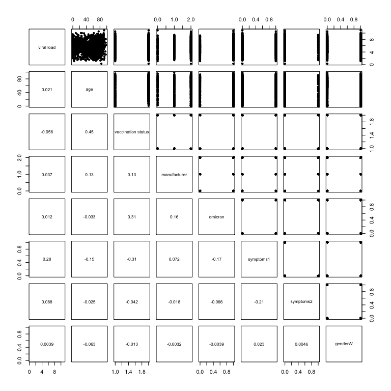
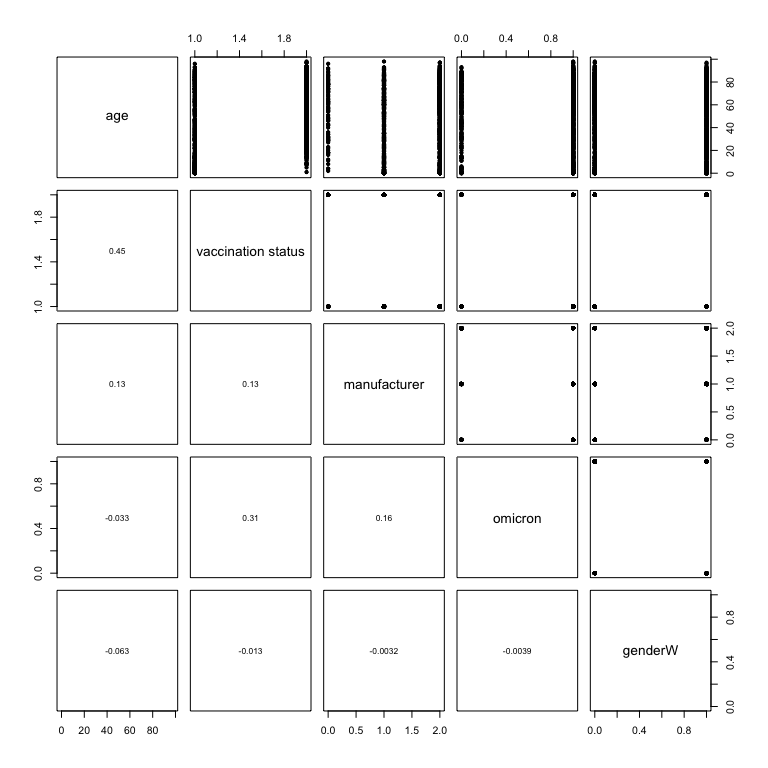
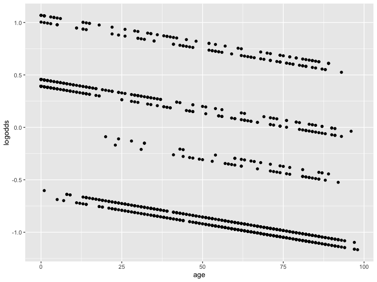
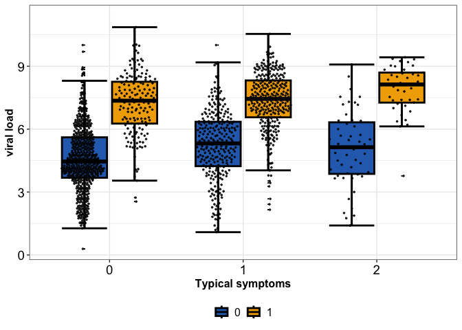
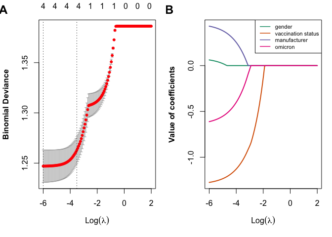
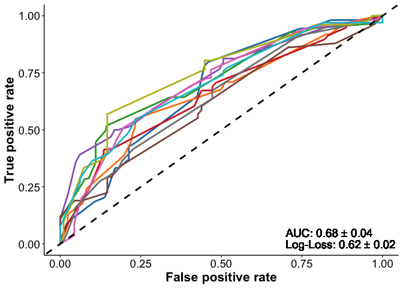
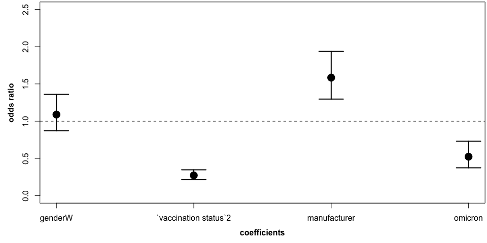

SARS-CoV-2 Antigen Rapid Detection Tests: test performance during the COVID-19 pandemic and the impact of COVID-19 vaccination
================

Isabell Wagenhäuser<sup>1,2</sup>; Kerstin Knies<sup>3</sup>; Tamara Pscheidl<sup>1,4</sup>; Michael Eisenmann<sup>1</sup>; Sven Flemming<sup>5</sup>; Nils Petri<sup>2</sup>; Miriam McDonogh<sup>4,6</sup>; Agmal Scherzad<sup>7</sup>; Daniel Zeller<sup>8</sup>; Anja Gesierich<sup>9</sup>; Anna Katharina Seitz<sup>10</sup>; Regina Taurines<sup>11</sup>; Ralf-Ingo Ernestus<sup>12</sup>; Johannes Forster<sup>13</sup>; Dirk Weismann<sup>2</sup>; Benedikt Weißbrich<sup>3</sup>; Johannes Liese<sup>14</sup>; Christoph Härtel<sup>14</sup>; Oliver Kurzai<sup>13,15</sup>; Lars Dölken<sup>3</sup>; Alexander Gabel<sup>1,16</sup>; Manuel Krone<sup>1,13</sup>

**Affiliations:** <br /> 
<sup>1</sup> Infection Control and Antimicrobial Stewardship Unit, University Hospital Würzburg, Josef-Schneider-Str. 2, 97080 Würzburg, Germany
<sup>2</sup> Department of Internal Medicine I, University Hospital Würzburg, Oberdürrbacher Str. 6, 97080 Würzburg, Germany
<sup>3</sup> Institute for Virology and Immunobiology, Julius-Maximilians-Universität Würzburg, Versbacher Str. 7, 97078 Würzburg, Germany 
<sup>4</sup> Department of Anaesthesia and Critical Care, University Hospital Würzburg, Oberdürrbacher Str. 6, 97080 Würzburg, Germany
<sup>5</sup> Department of General, Visceral, Transplantation, Vascular, and Paediatric Surgery, University Hospital Würzburg, Oberdürrbacher Str. 6, 97080 Würzburg, Germany
<sup>6</sup> Department of Orthopaedic Trauma, Hand, Plastic, and Reconstructive Surgery, University Hospital Würzburg, Oberdürrbacher Str. 6, 97080 Würzburg, Germany 
<sup>7</sup> Department of Otorhinolaryngology, Plastic, Aesthetic, and Reconstructive Head and Neck Surgery, University Hospital Würzburg, Josef-Schneider-Str. 11, 97080 Würzburg, Germany
<sup>8</sup> Department of Neurology, University Hospital Würzburg, Josef-Schneider-Str. 11, 97080 Würzburg, Germany
<sup>9</sup> Department of Dermatology, Venerology, and Allergology, University Hospital Würzburg, Josef-Schneider-Str. 2, 97080 Würzburg, Germany
<sup>10</sup> Department of Urology, University Hospital Würzburg, Oberdürrbacher Str. 6, 97080 Würzburg, Germany
<sup>11</sup> Department of Child and Adolescent Psychiatry, Psychosomatics, and Psychotherapy, University Hospital Würzburg, Margarete-Höppel-Platz 1, 97080 Würzburg
<sup>12</sup> Department of Neurosurgery, University Hospital Würzburg, Josef-Schneider-Str. 11, 97080 Würzburg, Germany
<sup>13</sup> Institute for Hygiene and Microbiology, Julius-Maximilians-Universität Würzburg, Josef-Schneider-Str. 2, 97080 Würzburg, Germany
<sup>14</sup> Department of Paediatrics, University Hospital Würzburg, Josef-Schneider-Str. 2, 97080 Würzburg, Germany
<sup>15</sup> Leibniz Institute for Natural Product Research and Infection Biology – Hans-Knoell-Institute, Beutenbergstraße 13, 07745 Jena, Germany
<sup>16</sup> Helmholtz Institute for RNA-based Infection Research (HIRI), Helmholtz Centre for Infection Research (HZI), Josef-Schneider-Str. 2, 97080 Würzburg, Germany<br />

Corresponding author: Manuel Krone, Infection Control and Antimicrobial Stewardship Unit, University Hospital Würzburg, Josef-Schneider-Str. 2 / E1, 97080 Würzburg, Germany, krone_m@ukw.de, phone: +49-931-201-46710, fax: +49-931-201-604694


Reproducible Script
================


- [Libraries and Functions](#libraries-and-functions)
- [Factors influencing test result of
  RDT](#factors-influencing-test-result-of-rdt)
  - [Adult data set with all
    variants](#adult-data-set-with-all-variants)
  - [Perform lasso for minimal
    lambda](#perform-lasso-for-minimal-lambda)
  - [ROC lasso regression](#roc-lasso-regression)
  - [Final logistic regression based on selected
    features](#final-logistic-regression-based-on-selected-features)
- [Associated factors with symptom
  response](#associated-factors-with-symptom-response)
  - [Logistic regression](#logistic-regression)
  - [Pairwise comparison: Age and Vaccination
    status](#pairwise-comparison-age-and-vaccination-status)
  - [Pairwise comparison: Age and
    Symptoms](#pairwise-comparison-age-and-symptoms)
  - [Data set with all variants](#data-set-with-all-variants)
  - [Perform lasso for minimal
    lambda](#perform-lasso-for-minimal-lambda-1)
  - [ROC lasso regression](#roc-lasso-regression-1)
  - [Final logistic regression based on selected
    features](#final-logistic-regression-based-on-selected-features-1)
- [Factors influencing test result of RDT (only first
  participation)](#factors-influencing-test-result-of-rdt-only-first-participation)
  - [Adult data set with all
    variants](#adult-data-set-with-all-variants-1)
  - [Perform lasso for minimal
    lambda](#perform-lasso-for-minimal-lambda-2)
  - [ROC lasso regression](#roc-lasso-regression-2)
  - [Final logistic regression based on selected
    features](#final-logistic-regression-based-on-selected-features-2)

# Libraries and Functions

``` r
library(dplyr)
library(writexl)
library(tidyr)
library(pROC)
library(ggplot2)
source("scripts/helper_functions.R")
```

``` r
setwd("~/CoVacSer/RDT_4/Manuscript/git/SARS-CoV-2-Antigen-Rapid-Detection-Tests/")

plt_dir <- file.path("plots/lasso_test_results")
res_dir <- file.path("results/lasso_test_results")

if(!dir.exists(plt_dir)){
  dir.create(plt_dir)
}

if(!dir.exists(res_dir)){
  dir.create(res_dir)
}

df <- readr::read_csv2("data/data.csv")
```

# Factors influencing test result of RDT

**ASSUMPTION OF THE ABSENCE OF MULTICOLLINEARITY**

``` r
df_box_tid <- df %>% dplyr::mutate(symptoms1 = if_else(symptoms == 1, true = 1, false = 0),
                           symptoms2 = if_else(symptoms == 2, true = 1, false = 0),
                           omicron = as.numeric(omicron),
                           `vaccination status` = as.numeric(`vaccination status`),
                           `viral load` = as.numeric( `viral load`),
                           genderW = if_else(gender == "W", true = 1, false = 0)) %>%
                dplyr::select(-symptoms, -gender)

png(filename = file.path(plt_dir, paste0("Scatter_all_pairs.png")),units="px", width=5000, height=5000, res=300)
pairs(df_box_tid %>% dplyr::select(-ID, -`test result`), lower.panel = panel.cor, pch = 20)
dev.off()

pairs(df_box_tid %>% dplyr::select(-ID, -`test result`), lower.panel = panel.cor, pch = 20)
```

<!-- -->

**ASSUMPTION OF LINEARITY OF INDEPENDENT VARIABLES AND LOG ODDS**

Check with Box-Tidwell test with transformed continuous variables

``` r
lreg <- glm(`test result` ~ age + ageTrans + `viral load` + viral_loadTrans + genderW + symptoms1 + symptoms2 + `vaccination status` + omicron + manufacturer, 
            data = df_box_tid %>% mutate(ageTrans = age * log(age),
                                 viral_loadTrans = `viral load` * log(`viral load`)), 
            family=binomial(link="logit"))

as.data.frame(summary(lreg)$coefficients) %>% 
  as_tibble(rownames = "Feature") %>% 
  mutate(across(where(is.double), 
                ~ format(.x, digits = 2, scientific = T))) %>% 
  knitr::kable()
```

| Feature              | Estimate | Std. Error | z value  | Pr(\>\|z\|) |
|:---------------------|:---------|:-----------|:---------|:------------|
| (Intercept)          | -4.5e+00 | 1.8e+00    | -2.5e+00 | 1.3e-02     |
| age                  | -7.1e-03 | 4.1e-02    | -1.7e-01 | 8.6e-01     |
| ageTrans             | 2.0e-03  | 8.6e-03    | 2.3e-01  | 8.1e-01     |
| `viral load`         | 2.1e-02  | 8.4e-01    | 2.5e-02  | 9.8e-01     |
| viral_loadTrans      | 3.3e-01  | 3.0e-01    | 1.1e+00  | 2.7e-01     |
| genderW              | 1.7e-01  | 1.5e-01    | 1.1e+00  | 2.7e-01     |
| symptoms1            | 8.8e-01  | 1.7e-01    | 5.4e+00  | 8.7e-08     |
| symptoms2            | 3.2e-01  | 3.1e-01    | 1.0e+00  | 3.0e-01     |
| `vaccination status` | -3.5e-01 | 2.1e-01    | -1.7e+00 | 9.8e-02     |
| omicron              | -1.2e-01 | 2.3e-01    | -5.2e-01 | 6.0e-01     |
| manufacturer         | 4.6e-02  | 1.3e-01    | 3.6e-01  | 7.2e-01     |

## Adult data set with all variants

``` r
y <- df %>% pull(`test result`)
X <- df %>% dplyr::select(-ID, -`test result`) %>%
            dplyr::mutate(symptoms = factor(symptoms),# + 1, levels = 1:3),
                          gender = factor(gender, levels = c("M", "W")),
                          `vaccination status` = as.factor(as.numeric(`vaccination status`)),
                          manufacturer = factor(manufacturer))
X_lasso <- X %>% mutate(across(where(is.factor), .fns = as.integer)) %>% as.matrix()

## 3. 10-fold cross validation to estimate lambda

set.seed(10)
lambdas2try <- exp(seq(-6, 2, length.out = 120))
lasso_cv <- glmnet::cv.glmnet(x = X_lasso, y = y, family = "binomial", alpha = 1, nfolds = 10, lambda = lambdas2try,
                              intercept = FALSE, standardize = TRUE)


model_all_lambdas <- glmnet::glmnet(x = X_lasso, y = y, family = "binomial", alpha = 1, nfolds = 10, lambda = lambdas2try)
par(mfcol = c(1,2), mar=c(5,4.,2.,1)+0.1, font.lab = 2)
plot(lasso_cv)
put.fig.letter(label="A", location="topleft", font=2, cex = 1.5)
matplot(log(model_all_lambdas$lambda), t(as.matrix(model_all_lambdas$beta)), type = "l", lty = rep(c(1,2), each = 9), col = RColorBrewer::brewer.pal(6,"Dark2"), lwd = 2,
        xlab = parse(text = ("Log(lambda)")), ylab = "Value of coefficients")
legend("topright", lty = rep(c(1,2), each = 9), col = rep(RColorBrewer::brewer.pal(6,"Dark2"), 2) , lwd = 1.5, cex = .7,
       legend = rownames(model_all_lambdas$beta))
put.fig.letter(label="B", location="topleft", font=2, cex = 1.5)
```

<!-- -->

``` r
pdf(file.path(plt_dir, "LASSO_REGRESSION.pdf"), width = 10, height = 4)
par(mfcol = c(1,2), mar=c(5,4.,2.,1)+0.1, font.lab = 2)
plot(lasso_cv)
put.fig.letter(label="A", location="topleft", font=2, cex = 1.5)
matplot(log(model_all_lambdas$lambda), t(as.matrix(model_all_lambdas$beta)), type = "l", lty = rep(c(1,2), each = 9), col = RColorBrewer::brewer.pal(6,"Dark2"), lwd = 2,
        xlab = parse(text = ("Log(lambda)")), ylab = "Value of coefficients")
legend("topright", lty = rep(c(1,2), each = 9), col = rep(RColorBrewer::brewer.pal(6,"Dark2"), 2) , lwd = 1.5, cex = .7,
       legend = rownames(model_all_lambdas$beta))
put.fig.letter(label="B", location="topleft", font=2, cex = 1.5)
dev.off()
```

## Perform lasso for minimal lambda

``` r
model_all_lambdas <- glmnet::glmnet(x = X_lasso, y = y, family = "binomial", alpha = 1, nfolds = 10, lambda = lasso_cv$lambda.min)

lambda_cv <- lasso_cv$lambda.min
lasso_best <- broom::tidy(lasso_cv)[lasso_cv$index,] %>% dplyr::rename(MSE = estimate)
lasso_best %>% knitr::kable(digits = 3)
```

| lambda |   MSE | std.error | conf.low | conf.high | nzero |
|-------:|------:|----------:|---------:|----------:|------:|
|  0.007 | 0.952 |     0.015 |    0.936 |     0.967 |     6 |
|  0.026 | 0.965 |     0.012 |    0.954 |     0.977 |     5 |

## ROC lasso regression

<!-- -->

## Final logistic regression based on selected features

``` r
## Extract varaibles unequal zero after lasso
lasso_vars_gt_zero <- rownames(model_all_lambdas$beta)[as.matrix(model_all_lambdas$beta)[,1] != 0]
```

### Odds ratios

viral load, gender, symptoms, vaccination status, omicron

``` r
df_logit <- df %>% dplyr::select(`test result`, matches(paste0(lasso_vars_gt_zero, collapse = "|"))) %>%
            dplyr::mutate(symptoms = factor(symptoms),
                          gender = factor(gender, levels = c("M", "W")),
                          `vaccination status` = as.factor(as.numeric(`vaccination status`)))

# Perform final logistic regression with shrinked data set
glm_full <- glm(`test result` ~ .,data = df_logit, family=binomial(link='logit'))

df_coefs <- as.data.frame(summary(glm_full)$coefficients) %>% as_tibble(rownames = "Feature")

odds_ratio <- data.frame(odds_ratio = exp(coefficients(glm_full)[-1])) %>% as_tibble(rownames = "Feature")
odds_ratio_ci <- data.frame(exp(confint.default(glm_full)[-1,]), check.names = F) %>% as_tibble(rownames = "Feature")

# Store odds ratios and p values of lasso regression

odds_ratio %>% inner_join(odds_ratio_ci) %>% inner_join(df_coefs) %>%
  writexl::write_xlsx(path = file.path(res_dir, "lasso_coefs_odds_ratios.xlsx"))

odds_ratio_ci <- odds_ratio_ci %>% as.data.frame()

# Plot odds ratios and CI

pdf(file.path(plt_dir, "odds_ratio.pdf"), width = 20, height = 7)
par(mgp = c(2.5,1,0), font.lab = 2, mfrow=c(1,1), mar = c(4.1, 4.1, 0.2, 0.2))
plot(seq_len(nrow(odds_ratio)), odds_ratio %>% pull(odds_ratio),
     ylim = c(-1,5), pch = 20, cex = 3, xaxt = "n", xlab = "coefficients",  ylab = "odds ratio")
sapply(seq_len(nrow(odds_ratio)), function(i){
  arrows(x0=i, y0=odds_ratio_ci[i,2], x1=i, y1=odds_ratio_ci[i,3], code=3, col="black", lwd=2, angle=90, length=0.25)
})
axis(side = 1, at = seq_len(nrow(odds_ratio)), labels = odds_ratio %>% pull(Feature))
abline(h = 1, lty = 2)
dev.off()

# Write data into excel

sample_sizes_df <- df_logit %>% 
                    dplyr::select(matches(paste0(lasso_vars_gt_zero[!lasso_vars_gt_zero %in% c("age", "viral load")], collapse = "|"))) %>% 
                    mutate(omicron = factor(omicron)) %>%
  tidyr::pivot_longer(cols = matches("*"), names_to = "feature", values_to = "value", values_transform = list(value = as.character)) %>%
  group_by(feature, value) %>% count() %>%
  group_by(feature) %>%
  mutate(rel = n/sum(n))
  
writexl::write_xlsx(sample_sizes_df, path = file.path(res_dir, "sample_sizes_for_features.xlsx"))

par(mgp = c(2.5,1,0), font.lab = 2, mfrow=c(1,1), mar = c(4.1, 4.1, 0.2, 0.2))
plot(seq_len(nrow(odds_ratio)), odds_ratio %>% pull(odds_ratio),
     ylim = c(-1,5), pch = 20, cex = 3, xaxt = "n", xlab = "coefficients",  ylab = "odds ratio")
sapply(seq_len(nrow(odds_ratio)), function(i){
  arrows(x0=i, y0=odds_ratio_ci[i,2], x1=i, y1=odds_ratio_ci[i,3], code=3, col="black", lwd=2, angle=90, length=0.25)
})
axis(side = 1, at = seq_len(nrow(odds_ratio)), labels = odds_ratio %>% pull(Feature))
abline(h = 1, lty = 2)
```

<!-- -->

**Odds ratio table**

``` r
padj_df <- data.frame(Feature = df_coefs$Feature, 
                      p.adj = p.adjust(df_coefs$`Pr(>|z|)`, method = "BY"))

sum_odds_ratio_table <- odds_ratio %>% 
                        inner_join(odds_ratio_ci) %>% 
                        inner_join(df_coefs) %>%
                        inner_join(padj_df)

sum_odds_ratio_table %>% 
  mutate(across(where(is.double), 
                ~ format(.x, digits = 3, scientific = TRUE))) %>% 
  knitr::kable()
```

| Feature | odds_ratio | 2.5 % | 97.5 % | Estimate | Std. Error | z value | Pr(\>\|z\|) | p.adj |
|:---|:---|:---|:---|:---|:---|:---|:---|:---|
| `viral load` | 2.62e+00 | 2.35e+00 | 2.91e+00 | 9.61e-01 | 5.40e-02 | 1.78e+01 | 8.61e-71 | 1.56e-69 |
| genderW | 1.15e+00 | 8.65e-01 | 1.53e+00 | 1.40e-01 | 1.45e-01 | 9.62e-01 | 3.36e-01 | 1.00e+00 |
| symptoms1 | 2.42e+00 | 1.77e+00 | 3.31e+00 | 8.86e-01 | 1.59e-01 | 5.55e+00 | 2.80e-08 | 1.70e-07 |
| symptoms2 | 1.39e+00 | 7.73e-01 | 2.48e+00 | 3.26e-01 | 2.98e-01 | 1.09e+00 | 2.74e-01 | 9.94e-01 |
| `vaccination status`2 | 7.58e-01 | 5.47e-01 | 1.05e+00 | -2.77e-01 | 1.66e-01 | -1.67e+00 | 9.57e-02 | 4.34e-01 |
| omicron | 8.62e-01 | 5.71e-01 | 1.30e+00 | -1.48e-01 | 2.10e-01 | -7.04e-01 | 4.81e-01 | 1.00e+00 |

### Group sizes

``` r
sample_sizes_df %>%
  mutate(across(where(is.double), ~ round(.x, digits = 2))) %>% 
  knitr::kable()
```

| feature            | value |    n |  rel |
|:-------------------|:------|-----:|-----:|
| gender             | M     |  797 | 0.54 |
| gender             | W     |  675 | 0.46 |
| omicron            | 0     |  205 | 0.14 |
| omicron            | 1     | 1267 | 0.86 |
| symptoms           | 0     |  798 | 0.54 |
| symptoms           | 1     |  582 | 0.40 |
| symptoms           | 2     |   92 | 0.06 |
| vaccination status | 1     |  494 | 0.34 |
| vaccination status | 2     |  978 | 0.66 |

# Associated factors with symptom response

- reduce analysis only to two categories
  - “0” -\> atypical or no symptoms
  - “1” -\> typical symptoms

``` r
plt_dir <- file.path("plots/lasso_symptoms")
res_dir <- file.path("results/lasso_symptoms")

if(!dir.exists(plt_dir)){
  dir.create(plt_dir)
}

if(!dir.exists(res_dir)){
  dir.create(res_dir)
}

df <- df %>% dplyr::select(-`viral load`, -`test result`) %>%
             mutate(symptoms = if_else(symptoms == 1, true = 1, false = 0))
```

## Logistic regression

**ASSUMPTION OF THE ABSENCE OF MULTICOLLINEARITY**

Logistic regression requires there to be little or no multicollinearity
among the independent variables. This means that the independent
variables should not be too highly correlated with each other.

``` r
df_box_tid <- df %>% dplyr::mutate(omicron = as.numeric(omicron),
                           `vaccination status` = as.numeric(`vaccination status`),
                           genderW = if_else(gender == "W", true = 1, false = 0)) %>%
                               # age = if_else(age == 0, true = 0.5, false = age)) %>%
                dplyr::select(-gender)

png(filename = file.path(plt_dir, paste0("Scatter_all_pairs.png")),units="px", width=5000, height=5000, res=300)
pairs(df_box_tid %>% dplyr::select(-ID, -symptoms), lower.panel = panel.cor, pch = 20)
dev.off()

pairs(df_box_tid %>% dplyr::select(-ID, -symptoms), lower.panel = panel.cor, pch = 20)
```

<!-- -->

**ASSUMPTION OF LINEARITY OF INDEPENDENT VARIABLES AND LOG ODDS**

Check with Box-Tidwell test with transformed continuous variables

``` r
lreg <- glm(symptoms ~ age + ageTrans + genderW  + `vaccination status` + omicron, 
            data = df_box_tid %>% mutate(ageTrans = age * log(age)), 
            family=binomial(link="logit"))

as.data.frame(summary(lreg)$coefficients) %>% 
  as_tibble(rownames = "Feature") %>% 
  mutate(across(where(is.double), 
                ~ format(.x, digits = 2, scientific = T))) %>% 
  knitr::kable()
```

| Feature              | Estimate | Std. Error | z value  | Pr(\>\|z\|) |
|:---------------------|:---------|:-----------|:---------|:------------|
| (Intercept)          | 2.6e+00  | 2.8e-01    | 9.2e+00  | 5.0e-20     |
| age                  | -1.6e-01 | 3.2e-02    | -5.1e+00 | 4.1e-07     |
| ageTrans             | 3.4e-02  | 6.8e-03    | 5.0e+00  | 6.4e-07     |
| genderW              | 8.0e-02  | 1.2e-01    | 6.9e-01  | 4.9e-01     |
| `vaccination status` | -7.4e-01 | 1.6e-01    | -4.8e+00 | 2.0e-06     |
| omicron              | -7.5e-01 | 1.8e-01    | -4.3e+00 | 2.0e-05     |

**AGE and AGETRANS show significant p values**

**Visual check of age shows linear relationship**

``` r
logit_model <- glm(symptoms ~ age + genderW + `vaccination status` + omicron, 
                   data = df_box_tid, 
                   family=binomial(link="logit"))

logodds <- logit_model$linear.predictors

plot.dat <- data.frame(logodds = logodds, age = df_box_tid$age)
ggplot(plot.dat, aes(x=age, y=logodds)) + geom_point()
```

<!-- -->

**–\> Remove age from logistic regression analysis \<–**

## Pairwise comparison: Age and Vaccination status

``` r
df4test <- df_box_tid %>% 
        dplyr::rename(vaccination_status = `vaccination status`) %>% 
        dplyr::mutate(vaccination_status = factor(if_else(vaccination_status == 1, true = "vaccinated", false = "not vaccinated"),
                                                  levels = c("vaccinated", "not vaccinated")))

wt_res <- wilcox.test(x = df4test %>% dplyr::filter(vaccination_status %in% "vaccinated") %>% pull(age),
                      y = df4test %>% dplyr::filter(vaccination_status %in% "not vaccinated") %>% pull(age))

df4test %>% 
  ggplot2::ggplot(ggplot2::aes(x = vaccination_status, y = age, fill = vaccination_status)) +
  ggplot2::stat_boxplot(geom = "errorbar", lwd = 1, width = 0.5, show.legend = FALSE) +
  ggplot2::geom_boxplot(color = "black", lwd = 1, show.legend = FALSE, outlier.size = 0) +
  ggbeeswarm::geom_quasirandom(alpha = 0.8, width = 0.4, pch = 20, size = 1) +
  ggplot2::theme_bw() +
  ggsci::scale_fill_nejm() +
  ggplot2::theme(axis.text = ggplot2::element_text(size = 14, colour = "black"),
                 axis.title = ggplot2::element_text(face = "bold", size = 12),
                 legend.title = ggplot2::element_blank(),
                 legend.text = ggplot2::element_text(size = 12),
                 legend.position = "none") +
  ggplot2::xlab("vaccination status") +
  ggplot2::ylab("Age") +
  ggsignif::geom_signif(comparisons = list(c("vaccinated", "not vaccinated")),
                        annotation = format(wt_res$p.value, scientific = T, digits = 2),
                        tip_length = c(0.2, 0.04)) + 
  ggplot2::scale_y_continuous(expand = expansion(mult = c(0.05, .1)))
```

<!-- -->

## Pairwise comparison: Age and Symptoms

``` r
df4test <- df_box_tid %>% 
        dplyr::mutate(symptoms = factor(if_else(symptoms == 0, true = "no", false = "yes"), levels = c("yes", "no")))

 wt_res <- wilcox.test(x = df4test %>% dplyr::filter(symptoms %in% "yes") %>% pull(age),
                       y = df4test %>% dplyr::filter(symptoms %in% "no") %>% pull(age))

df4test %>% 
  ggplot2::ggplot(ggplot2::aes(x = symptoms, y = age, fill = symptoms)) +
  ggplot2::stat_boxplot(geom = "errorbar", lwd = 1, width = 0.5, show.legend = FALSE) +
  ggplot2::geom_boxplot(color = "black", lwd = 1, show.legend = FALSE, outlier.size = 0) +
  ggbeeswarm::geom_quasirandom(alpha = 0.8, width = 0.4, pch = 20, size = 1) +
  ggplot2::theme_bw() +
  ggsci::scale_fill_bmj() +
  ggplot2::theme(axis.text = ggplot2::element_text(size = 14, colour = "black"),
                 axis.title = ggplot2::element_text(face = "bold", size = 12),
                 legend.title = ggplot2::element_blank(),
                 legend.text = ggplot2::element_text(size = 12),
                 legend.position = "none") +
  ggplot2::xlab("Typical symptoms") +
  ggplot2::ylab("Age") +
  ggsignif::geom_signif(comparisons = list(c("yes", "no")),
                        annotation = format(wt_res$p.value, scientific = T, digits = 2),
                        tip_length = c(0.2, 0.04)) + 
  ggplot2::scale_y_continuous(expand = expansion(mult = c(0.05, .1)))
```

<!-- -->

## Data set with all variants

``` r
df <- df %>% dplyr::select(-age)

y <- df %>% pull(symptoms)
X <- df %>% dplyr::select(-ID, -symptoms) %>%
            dplyr::mutate(gender = factor(gender, levels = c("M", "W")),
                          `vaccination status` = as.factor(as.numeric(`vaccination status`)))
X_lasso <- X %>% mutate(across(where(is.factor), .fns = as.integer)) %>% as.matrix()

## 3. 10-fold cross validation to estimate lambda

set.seed(10)
lambdas2try <- exp(seq(-6, 2, length.out = 120))
lasso_cv <- glmnet::cv.glmnet(x = X_lasso, y = y, family = "binomial", alpha = 1, nfolds = 10, lambda = lambdas2try,
                              intercept = FALSE, standardize = TRUE)


model_all_lambdas <- glmnet::glmnet(x = X_lasso, y = y, family = "binomial", alpha = 1, nfolds = 10, lambda = lambdas2try)
par(mfcol = c(1,2), mar=c(5,4.,2.,1)+0.1, font.lab = 2)
plot(lasso_cv)
put.fig.letter(label="A", location="topleft", font=2, cex = 1.5)
matplot(log(model_all_lambdas$lambda), t(as.matrix(model_all_lambdas$beta)), type = "l", lty = rep(c(1,2), each = 9), col = RColorBrewer::brewer.pal(6,"Dark2"), lwd = 2,
        xlab = parse(text = ("Log(lambda)")), ylab = "Value of coefficients")
legend("topright", lty = rep(c(1,2), each = 9), col = rep(RColorBrewer::brewer.pal(6,"Dark2"), 2) , lwd = 1.5, cex = .7,
       legend = rownames(model_all_lambdas$beta))
put.fig.letter(label="B", location="topleft", font=2, cex = 1.5)
```

<!-- -->

``` r
pdf(file.path(plt_dir, "LASSO_REGRESSION.pdf"), width = 10, height = 4)
par(mfcol = c(1,2), mar=c(5,4.,2.,1)+0.1, font.lab = 2)
plot(lasso_cv)
put.fig.letter(label="A", location="topleft", font=2, cex = 1.5)
matplot(log(model_all_lambdas$lambda), t(as.matrix(model_all_lambdas$beta)), type = "l", lty = rep(c(1,2), each = 9), col = RColorBrewer::brewer.pal(6,"Dark2"), lwd = 2,
        xlab = parse(text = ("Log(lambda)")), ylab = "Value of coefficients")
legend("topright", lty = rep(c(1,2), each = 9), col = rep(RColorBrewer::brewer.pal(6,"Dark2"), 2) , lwd = 1.5, cex = .7,
       legend = rownames(model_all_lambdas$beta))
put.fig.letter(label="B", location="topleft", font=2, cex = 1.5)
dev.off()
```

quartz_off_screen 2

## Perform lasso for minimal lambda

``` r
model_all_lambdas <- glmnet::glmnet(x = X_lasso, y = y, family = "binomial", alpha = 1, nfolds = 10, lambda = lasso_cv$lambda.min)

lambda_cv <- lasso_cv$lambda.min
lasso_best <- broom::tidy(lasso_cv)[lasso_cv$index,] %>% dplyr::rename(MSE = estimate)
lasso_best %>% knitr::kable(digits = 3)
```

| lambda |   MSE | std.error | conf.low | conf.high | nzero |
|-------:|------:|----------:|---------:|----------:|------:|
|  0.002 | 1.247 |     0.016 |    1.231 |     1.263 |     4 |
|  0.030 | 1.263 |     0.013 |    1.250 |     1.276 |     4 |

## ROC lasso regression

<!-- -->

``` r
## Extract variables unequal zero after lasso
lasso_vars_gt_zero <- rownames(model_all_lambdas$beta)[as.matrix(model_all_lambdas$beta)[,1] != 0]
```

## Final logistic regression based on selected features

### Odds ratios

gender, vaccination status, manufacturer, omicron

``` r
df_logit <- df %>% dplyr::select(symptoms, matches(paste0(lasso_vars_gt_zero, collapse = "|"))) %>%
            dplyr::mutate(gender = factor(gender, levels = c("M", "W")),
                          `vaccination status` = as.factor(as.numeric(`vaccination status`)),
                          symptoms = factor(symptoms))

# Perform final logistic regression with shrinked data set
glm_full <- glm(symptoms ~ .,data = df_logit, family=binomial(link='logit'))

df_coefs <- as.data.frame(summary(glm_full)$coefficients) %>% as_tibble(rownames = "Feature")

odds_ratio <- data.frame(odds_ratio = exp(coefficients(glm_full)[-1])) %>% as_tibble(rownames = "Feature")
odds_ratio_ci <- data.frame(exp(confint.default(glm_full)[-1,]), check.names = F) %>% as_tibble(rownames = "Feature")

# Store odds ratios and p values of lasso regression

odds_ratio %>% inner_join(odds_ratio_ci) %>% inner_join(df_coefs) %>%
  writexl::write_xlsx(path = file.path(res_dir, "lasso_coefs_odds_ratios.xlsx"))

odds_ratio_ci <- odds_ratio_ci %>% as.data.frame()

# Plot odds ratios and CI

pdf(file.path(plt_dir, "odds_ratio.pdf"), width = 20, height = 7)
par(mgp = c(2.5,1,0), font.lab = 2, mfrow=c(1,1), mar = c(4.1, 4.1, 0.2, 0.2))
plot(seq_len(nrow(odds_ratio)), odds_ratio %>% pull(odds_ratio),
     ylim = c(-1,5), pch = 20, cex = 3, xaxt = "n", xlab = "coefficients",  ylab = "odds ratio")
sapply(seq_len(nrow(odds_ratio)), function(i){
  arrows(x0=i, y0=odds_ratio_ci[i,2], x1=i, y1=odds_ratio_ci[i,3], code=3, col="black", lwd=2, angle=90, length=0.25)
})
axis(side = 1, at = seq_len(nrow(odds_ratio)), labels = odds_ratio %>% pull(Feature))
abline(h = 1, lty = 2)
dev.off()

# Write data into excel

sample_sizes_df <- df_logit %>% 
                    dplyr::select(matches(paste0(lasso_vars_gt_zero[!lasso_vars_gt_zero %in% c("age", "viral load")], collapse = "|"))) %>% 
                    mutate(omicron = factor(omicron)) %>%
  tidyr::pivot_longer(cols = matches("*"), names_to = "feature", values_to = "value", values_transform = list(value = as.character)) %>%
  group_by(feature, value) %>% count() %>%
  group_by(feature) %>%
  mutate(rel = n/sum(n))
  
writexl::write_xlsx(sample_sizes_df, path = file.path(res_dir, "sample_sizes_for_features.xlsx"))

par(mgp = c(2.5,1,0), font.lab = 2, mfrow=c(1,1), mar = c(4.1, 4.1, 0.2, 0.2))
plot(seq_len(nrow(odds_ratio)), odds_ratio %>% pull(odds_ratio),
     ylim = c(0, 2.5), pch = 20, cex = 3, xaxt = "n", xlab = "coefficients",  ylab = "odds ratio")
sapply(seq_len(nrow(odds_ratio)), function(i){
  arrows(x0=i, y0=odds_ratio_ci[i,2], x1=i, y1=odds_ratio_ci[i,3], code=3, col="black", lwd=2, angle=90, length=0.25)
})
axis(side = 1, at = seq_len(nrow(odds_ratio)), labels = odds_ratio %>% pull(Feature))
abline(h = 1, lty = 2)
```

<!-- -->

``` r
padj_df <- data.frame(Feature = df_coefs$Feature, 
                      p.adj = p.adjust(df_coefs$`Pr(>|z|)`, method = "BY"))

sum_odds_ratio_table <- odds_ratio %>% 
                        inner_join(odds_ratio_ci) %>% 
                        inner_join(df_coefs) %>%
                        inner_join(padj_df)

sum_odds_ratio_table %>% 
  mutate(across(where(is.double), 
                ~ format(.x, digits = 3, scientific = TRUE))) %>% 
  knitr::kable()
```

| Feature | odds_ratio | 2.5 % | 97.5 % | Estimate | Std. Error | z value | Pr(\>\|z\|) | p.adj |
|:---|:---|:---|:---|:---|:---|:---|:---|:---|
| genderW | 1.09e+00 | 8.72e-01 | 1.36e+00 | 8.54e-02 | 1.14e-01 | 7.52e-01 | 4.52e-01 | 1.00e+00 |
| `vaccination status`2 | 2.73e-01 | 2.14e-01 | 3.47e-01 | -1.30e+00 | 1.23e-01 | -1.05e+01 | 6.72e-26 | 7.67e-25 |
| manufacturer | 1.58e+00 | 1.30e+00 | 1.94e+00 | 4.60e-01 | 1.02e-01 | 4.50e+00 | 6.90e-06 | 3.94e-05 |
| omicron | 5.24e-01 | 3.74e-01 | 7.32e-01 | -6.47e-01 | 1.71e-01 | -3.78e+00 | 1.55e-04 | 5.90e-04 |

### Group sizes

``` r
sample_sizes_df %>% mutate(across(where(is.double), ~ round(.x, digits = 2))) %>% 
knitr::kable() 
```

| feature            | value |    n |  rel |
|:-------------------|:------|-----:|-----:|
| gender             | M     |  797 | 0.54 |
| gender             | W     |  675 | 0.46 |
| manufacturer       | 0     |   90 | 0.06 |
| manufacturer       | 1     |  347 | 0.24 |
| manufacturer       | 2     | 1035 | 0.70 |
| omicron            | 0     |  205 | 0.14 |
| omicron            | 1     | 1267 | 0.86 |
| vaccination status | 1     |  494 | 0.34 |
| vaccination status | 2     |  978 | 0.66 |

# Factors influencing test result of RDT (only first participation)

``` r
plt_dir <- file.path("plots/lasso_test_results_single_participation")
res_dir <- file.path("results/lasso_test_results_single_participation")

if(!dir.exists(plt_dir)){
  dir.create(plt_dir)
}

if(!dir.exists(res_dir)){
  dir.create(res_dir)
}

df <- readr::read_csv2("data/single_participation_data.csv")
```

**ASSUMPTION OF THE ABSENCE OF MULTICOLLINEARITY**

``` r
df_box_tid <- df %>% dplyr::mutate(symptoms1 = if_else(symptoms == 1, true = 1, false = 0),
                           symptoms2 = if_else(symptoms == 2, true = 1, false = 0),
                           omicron = as.numeric(omicron),
                           `vaccination status` = as.numeric(`vaccination status`),
                           `viral load` = as.numeric( `viral load`),
                           genderW = if_else(gender == "W", true = 1, false = 0)) %>%
                               # age = if_else(age == 0, true = 0.5, false = age)) %>%
                dplyr::select(-symptoms, -gender)

png(filename = file.path(plt_dir, paste0("Scatter_all_pairs.png")),units="px", width=5000, height=5000, res=300)
pairs(df_box_tid %>% dplyr::select(-ID, -`test result`), lower.panel = panel.cor, pch = 20)
dev.off()

pairs(df_box_tid %>% dplyr::select(-ID, -`test result`), lower.panel = panel.cor, pch = 20)
```

<!-- -->

**ASSUMPTION OF LINEARITY OF INDEPENDENT VARIABLES AND LOG ODDS**

Check with Box-Tidwell test with transformed continuous variables

``` r
lreg <- glm(`test result` ~ age + ageTrans + `viral load` + viral_loadTrans + genderW + symptoms1 + symptoms2 + `vaccination status` + omicron + manufacturer, 
            data = df_box_tid %>% mutate(ageTrans = age * log(age),
                                         viral_loadTrans = `viral load` * log(`viral load`)), 
            family=binomial(link="logit"))

as.data.frame(summary(lreg)$coefficients) %>% 
  as_tibble(rownames = "Feature") %>% 
  mutate(across(where(is.double), 
                ~ format(.x, digits = 2, scientific = T))) %>% 
knitr::kable()
```

| Feature              | Estimate | Std. Error | z value  | Pr(\>\|z\|) |
|:---------------------|:---------|:-----------|:---------|:------------|
| (Intercept)          | -5.7e+00 | 2.3e+00    | -2.4e+00 | 1.5e-02     |
| age                  | -6.6e-03 | 4.7e-02    | -1.4e-01 | 8.9e-01     |
| ageTrans             | 2.5e-03  | 9.9e-03    | 2.6e-01  | 8.0e-01     |
| `viral load`         | 6.7e-01  | 1.1e+00    | 6.3e-01  | 5.3e-01     |
| viral_loadTrans      | 1.0e-01  | 3.8e-01    | 2.7e-01  | 7.9e-01     |
| genderW              | 1.1e-01  | 1.8e-01    | 6.4e-01  | 5.2e-01     |
| symptoms1            | 8.6e-01  | 2.0e-01    | 4.3e+00  | 1.8e-05     |
| symptoms2            | 2.3e-01  | 3.4e-01    | 6.8e-01  | 4.9e-01     |
| `vaccination status` | -3.7e-01 | 2.3e-01    | -1.6e+00 | 1.1e-01     |
| omicron              | -1.5e-01 | 2.6e-01    | -6.0e-01 | 5.5e-01     |
| manufacturer         | -3.5e-02 | 1.5e-01    | -2.3e-01 | 8.1e-01     |

## Adult data set with all variants

``` r
y <- df %>% pull(`test result`)
X <- df %>% dplyr::select(-ID, -`test result`) %>%
            dplyr::mutate(symptoms = factor(symptoms),# + 1, levels = 1:3),
                          gender = factor(gender, levels = c("M", "W")),
                          `vaccination status` = as.factor(as.numeric(`vaccination status`)),
                          manufacturer = factor(manufacturer))
X_lasso <- X %>% mutate(across(where(is.factor), .fns = as.integer)) %>% as.matrix()

## 3. 10-fold cross validation to estimate lambda

set.seed(10)
lambdas2try <- exp(seq(-6, 2, length.out = 120))
lasso_cv <- glmnet::cv.glmnet(x = X_lasso, y = y, family = "binomial", alpha = 1, nfolds = 10, lambda = lambdas2try,
                              intercept = FALSE, standardize = TRUE)


model_all_lambdas <- glmnet::glmnet(x = X_lasso, y = y, family = "binomial", alpha = 1, nfolds = 10, lambda = lambdas2try)
par(mfcol = c(1,2), mar=c(5,4.,2.,1)+0.1, font.lab = 2)
plot(lasso_cv)
put.fig.letter(label="A", location="topleft", font=2, cex = 1.5)
matplot(log(model_all_lambdas$lambda), t(as.matrix(model_all_lambdas$beta)), type = "l", lty = rep(c(1,2), each = 9), col = RColorBrewer::brewer.pal(6,"Dark2"), lwd = 2,
        xlab = parse(text = ("Log(lambda)")), ylab = "Value of coefficients")
legend("topright", lty = rep(c(1,2), each = 9), col = rep(RColorBrewer::brewer.pal(6,"Dark2"), 2) , lwd = 1.5, cex = .7,
       legend = rownames(model_all_lambdas$beta))
put.fig.letter(label="B", location="topleft", font=2, cex = 1.5)
```

<!-- -->

``` r
pdf(file.path(plt_dir, "LASSO_REGRESSION.pdf"), width = 10, height = 4)
par(mfcol = c(1,2), mar=c(5,4.,2.,1)+0.1, font.lab = 2)
plot(lasso_cv)
put.fig.letter(label="A", location="topleft", font=2, cex = 1.5)
matplot(log(model_all_lambdas$lambda), t(as.matrix(model_all_lambdas$beta)), type = "l", lty = rep(c(1,2), each = 9), col = RColorBrewer::brewer.pal(6,"Dark2"), lwd = 2,
        xlab = parse(text = ("Log(lambda)")), ylab = "Value of coefficients")
legend("topright", lty = rep(c(1,2), each = 9), col = rep(RColorBrewer::brewer.pal(6,"Dark2"), 2) , lwd = 1.5, cex = .7,
       legend = rownames(model_all_lambdas$beta))
put.fig.letter(label="B", location="topleft", font=2, cex = 1.5)
dev.off()
```

## Perform lasso for minimal lambda

``` r
model_all_lambdas <- glmnet::glmnet(x = X_lasso, y = y, family = "binomial", alpha = 1, nfolds = 10, lambda = lasso_cv$lambda.min)

lambda_cv <- lasso_cv$lambda.min
lasso_best <- broom::tidy(lasso_cv)[lasso_cv$index,] %>% dplyr::rename(MSE = estimate)
lasso_best %>% knitr::kable(digits = 3)
```

| lambda |   MSE | std.error | conf.low | conf.high | nzero |
|-------:|------:|----------:|---------:|----------:|------:|
|  0.003 | 0.976 |     0.027 |    0.949 |     1.003 |     7 |
|  0.032 | 1.001 |     0.022 |    0.979 |     1.023 |     5 |

## ROC lasso regression

<!-- -->

## Final logistic regression based on selected features

``` r
## Extract varaibles unequal zero after lasso
lasso_vars_gt_zero <- rownames(model_all_lambdas$beta)[as.matrix(model_all_lambdas$beta)[,1] != 0]
```

### Odds ratios

viral load, age, gender, symptoms, vaccination status, omicron

``` r
df_logit <- df %>% dplyr::select(`test result`, matches(paste0(lasso_vars_gt_zero, collapse = "|"))) %>%
            dplyr::mutate(symptoms = factor(symptoms),
                          gender = factor(gender, levels = c("M", "W")),
                          `vaccination status` = as.factor(as.numeric(`vaccination status`)))

# Perform final logistic regression with shrinked data set
glm_full <- glm(`test result` ~ .,data = df_logit, family=binomial(link='logit'))

df_coefs <- as.data.frame(summary(glm_full)$coefficients) %>% as_tibble(rownames = "Feature")

odds_ratio <- data.frame(odds_ratio = exp(coefficients(glm_full)[-1])) %>% as_tibble(rownames = "Feature")
odds_ratio_ci <- data.frame(exp(confint.default(glm_full)[-1,]), check.names = F) %>% as_tibble(rownames = "Feature")

# Store odds ratios and p values of lasso regression

odds_ratio %>% inner_join(odds_ratio_ci) %>% inner_join(df_coefs) %>%
  writexl::write_xlsx(path = file.path(res_dir, "lasso_coefs_odds_ratios.xlsx"))

odds_ratio_ci <- odds_ratio_ci %>% as.data.frame()

# Plot odds ratios and CI

pdf(file.path(plt_dir, "odds_ratio.pdf"), width = 20, height = 7)
par(mgp = c(2.5,1,0), font.lab = 2, mfrow=c(1,1), mar = c(4.1, 4.1, 0.2, 0.2))
plot(seq_len(nrow(odds_ratio)), odds_ratio %>% pull(odds_ratio),
     ylim = c(-1,5), pch = 20, cex = 3, xaxt = "n", xlab = "coefficients",  ylab = "odds ratio")
sapply(seq_len(nrow(odds_ratio)), function(i){
  arrows(x0=i, y0=odds_ratio_ci[i,2], x1=i, y1=odds_ratio_ci[i,3], code=3, col="black", lwd=2, angle=90, length=0.25)
})
axis(side = 1, at = seq_len(nrow(odds_ratio)), labels = odds_ratio %>% pull(Feature))
abline(h = 1, lty = 2)
dev.off()

# Write data into excel

sample_sizes_df <- df_logit %>% 
                    dplyr::select(matches(paste0(lasso_vars_gt_zero[!lasso_vars_gt_zero %in% c("age", "viral load")], collapse = "|"))) %>% 
                    mutate(omicron = factor(omicron)) %>%
  tidyr::pivot_longer(cols = matches("*"), names_to = "feature", values_to = "value", values_transform = list(value = as.character)) %>%
  group_by(feature, value) %>% count() %>%
  group_by(feature) %>%
  mutate(rel = n/sum(n))
  
writexl::write_xlsx(sample_sizes_df, path = file.path(res_dir, "sample_sizes_for_features.xlsx"))

par(mgp = c(2.5,1,0), font.lab = 2, mfrow=c(1,1), mar = c(4.1, 4.1, 0.2, 0.2))
plot(seq_len(nrow(odds_ratio)), odds_ratio %>% pull(odds_ratio),
     ylim = c(-1,5), pch = 20, cex = 3, xaxt = "n", xlab = "coefficients",  ylab = "odds ratio")
sapply(seq_len(nrow(odds_ratio)), function(i){
  arrows(x0=i, y0=odds_ratio_ci[i,2], x1=i, y1=odds_ratio_ci[i,3], code=3, col="black", lwd=2, angle=90, length=0.25)
})
axis(side = 1, at = seq_len(nrow(odds_ratio)), labels = odds_ratio %>% pull(Feature))
abline(h = 1, lty = 2)
```

<!-- -->

**Odds ratio table**

``` r
padj_df <- data.frame(Feature = df_coefs$Feature, 
                      p.adj = p.adjust(df_coefs$`Pr(>|z|)`, method = "BY"))

sum_odds_ratio_table <- odds_ratio %>% 
                        inner_join(odds_ratio_ci) %>% 
                        inner_join(df_coefs) %>%
                        inner_join(padj_df)

sum_odds_ratio_table %>% 
  mutate(across(where(is.double), 
                ~ format(.x, digits = 3, scientific = TRUE))) %>% 
  knitr::kable()
```

| Feature | odds_ratio | 2.5 % | 97.5 % | Estimate | Std. Error | z value | Pr(\>\|z\|) | p.adj |
|:---|:---|:---|:---|:---|:---|:---|:---|:---|
| `viral load` | 2.64e+00 | 2.33e+00 | 3.00e+00 | 9.72e-01 | 6.49e-02 | 1.50e+01 | 9.94e-51 | 2.16e-49 |
| age | 1.00e+00 | 9.98e-01 | 1.01e+00 | 4.56e-03 | 3.46e-03 | 1.32e+00 | 1.88e-01 | 8.17e-01 |
| genderW | 1.06e+00 | 7.55e-01 | 1.49e+00 | 6.03e-02 | 1.74e-01 | 3.46e-01 | 7.29e-01 | 1.00e+00 |
| symptoms1 | 2.42e+00 | 1.66e+00 | 3.54e+00 | 8.85e-01 | 1.94e-01 | 4.56e+00 | 5.05e-06 | 3.66e-05 |
| symptoms2 | 1.32e+00 | 6.86e-01 | 2.56e+00 | 2.81e-01 | 3.36e-01 | 8.37e-01 | 4.03e-01 | 1.00e+00 |
| `vaccination status`2 | 6.54e-01 | 4.25e-01 | 1.01e+00 | -4.24e-01 | 2.20e-01 | -1.93e+00 | 5.41e-02 | 2.94e-01 |
| omicron | 8.89e-01 | 5.51e-01 | 1.43e+00 | -1.18e-01 | 2.44e-01 | -4.82e-01 | 6.30e-01 | 1.00e+00 |

### Group sizes

``` r
sample_sizes_df %>% 
  mutate(across(where(is.double), ~ round(.x, digits = 2))) %>% 
  knitr::kable()
```

| feature            | value |   n |  rel |
|:-------------------|:------|----:|-----:|
| gender             | M     | 522 | 0.52 |
| gender             | W     | 482 | 0.48 |
| omicron            | 0     | 176 | 0.18 |
| omicron            | 1     | 828 | 0.82 |
| symptoms           | 0     | 505 | 0.50 |
| symptoms           | 1     | 425 | 0.42 |
| symptoms           | 2     |  74 | 0.07 |
| vaccination status | 1     | 408 | 0.41 |
| vaccination status | 2     | 596 | 0.59 |
