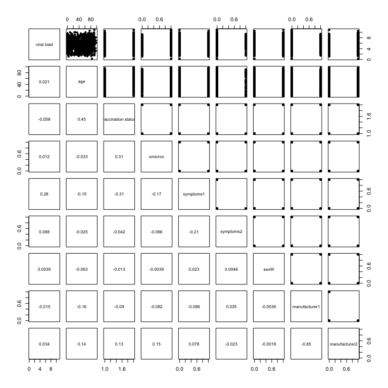

SARS-CoV-2 Antigen Rapid Detection Tests: test performance during the COVID-19 pandemic and the impact of COVID-19 vaccination
================

Isabell Wagenhäuser<sup>1,2</sup>; Kerstin Knies<sup>3</sup>; Tamara Pscheidl<sup>1,4</sup>; Michael Eisenmann<sup>1</sup>; Sven Flemming<sup>5</sup>; Nils Petri<sup>2</sup>; Miriam McDonogh<sup>4,6</sup>; Agmal Scherzad<sup>7</sup>; Daniel Zeller<sup>8</sup>; Anja Gesierich<sup>9</sup>; Anna Katharina Seitz<sup>10</sup>; Regina Taurines<sup>11</sup>; Ralf-Ingo Ernestus<sup>12</sup>; Johannes Forster<sup>13</sup>; Dirk Weismann<sup>2</sup>; Benedikt Weißbrich<sup>3</sup>; Johannes Liese<sup>14</sup>; Christoph Härtel<sup>14</sup>; Oliver Kurzai<sup>13,15</sup>; Lars Dölken<sup>3</sup>; Alexander Gabel<sup>1,16</sup>; Manuel Krone<sup>1,13</sup>

**Affiliations:** <br /> 
<sup>1</sup> Infection Control and Antimicrobial Stewardship Unit, University Hospital Würzburg, Josef-Schneider-Str. 2, 97080 Würzburg, Germany
<sup>2</sup> Department of Internal Medicine I, University Hospital Würzburg, Oberdürrbacher Str. 6, 97080 Würzburg, Germany
<sup>3</sup> Institute for Virology and Immunobiology, Julius-Maximilians-Universität Würzburg, Versbacher Str. 7, 97078 Würzburg, Germany 
<sup>4</sup> Department of Anaesthesia and Critical Care, University Hospital Würzburg, Oberdürrbacher Str. 6, 97080 Würzburg, Germany
<sup>5</sup> Department of General, Visceral, Transplantation, Vascular, and Paediatric Surgery, University Hospital Würzburg, Oberdürrbacher Str. 6, 97080 Würzburg, Germany
<sup>6</sup> Department of Orthopaedic Trauma, Hand, Plastic, and Reconstructive Surgery, University Hospital Würzburg, Oberdürrbacher Str. 6, 97080 Würzburg, Germany 
<sup>7</sup> Department of Otorhinolaryngology, Plastic, Aesthetic, and Reconstructive Head and Neck Surgery, University Hospital Würzburg, Josef-Schneider-Str. 11, 97080 Würzburg, Germany
<sup>8</sup> Department of Neurology, University Hospital Würzburg, Josef-Schneider-Str. 11, 97080 Würzburg, Germany
<sup>9</sup> Department of Dermatology, Venerology, and Allergology, University Hospital Würzburg, Josef-Schneider-Str. 2, 97080 Würzburg, Germany
<sup>10</sup> Department of Urology, University Hospital Würzburg, Oberdürrbacher Str. 6, 97080 Würzburg, Germany
<sup>11</sup> Department of Child and Adolescent Psychiatry, Psychosomatics, and Psychotherapy, University Hospital Würzburg, Margarete-Höppel-Platz 1, 97080 Würzburg
<sup>12</sup> Department of Neurosurgery, University Hospital Würzburg, Josef-Schneider-Str. 11, 97080 Würzburg, Germany
<sup>13</sup> Institute for Hygiene and Microbiology, Julius-Maximilians-Universität Würzburg, Josef-Schneider-Str. 2, 97080 Würzburg, Germany
<sup>14</sup> Department of Paediatrics, University Hospital Würzburg, Josef-Schneider-Str. 2, 97080 Würzburg, Germany
<sup>15</sup> Leibniz Institute for Natural Product Research and Infection Biology – Hans-Knoell-Institute, Beutenbergstraße 13, 07745 Jena, Germany
<sup>16</sup> Helmholtz Institute for RNA-based Infection Research (HIRI), Helmholtz Centre for Infection Research (HZI), Josef-Schneider-Str. 2, 97080 Würzburg, Germany<br />

Corresponding author: Manuel Krone, Infection Control and Antimicrobial Stewardship Unit, University Hospital Würzburg, Josef-Schneider-Str. 2 / E1, 97080 Würzburg, Germany, krone_m@ukw.de, phone: +49-931-201-46710, fax: +49-931-201-604694


Reproducible Script
================

- [Libraries and Functions](#libraries-and-functions)
- [Factors influencing test result of
  RDT](#factors-influencing-test-result-of-rdt)
  - [Adult data set with all
    variants](#adult-data-set-with-all-variants)
  - [Perform lasso for minimal
    lambda](#perform-lasso-for-minimal-lambda)
  - [ROC lasso regression](#roc-lasso-regression)
  - [Model 1: all factors after lasso](#model-1-all-factors-after-lasso)
  - [Model 2: viral load](#model-2-viral-load)
  - [Model 3: symptoms](#model-3-symptoms)
  - [Model 4: VOC omicron infection](#model-4-voc-omicron-infection)
  - [Model 5: vaccination status](#model-5-vaccination-status)
  - [Model 6: viral load and symptoms](#model-6-viral-load-and-symptoms)
  - [Pairwise comparison: viral load and
    symptoms](#pairwise-comparison-viral-load-and-symptoms)
  - [Model 7: viral load + vaccination
    status](#model-7-viral-load--vaccination-status)
  - [Model 8: vaccination status and
    symptoms](#model-8-vaccination-status-and-symptoms)
- [Summarized models](#summarized-models)
- [Associated factors with symptom
  response](#associated-factors-with-symptom-response)
  - [Logistic regression](#logistic-regression)
  - [Pairwise comparison: Age and Vaccination
    status](#pairwise-comparison-age-and-vaccination-status)
  - [Pairwise comparison: age and
    symptoms](#pairwise-comparison-age-and-symptoms)
  - [Data set with all variants](#data-set-with-all-variants)
  - [Perform lasso for minimal
    lambda](#perform-lasso-for-minimal-lambda-1)
  - [ROC lasso regression](#roc-lasso-regression-1)
  - [Model 1: all factors after
    lasso](#model-1-all-factors-after-lasso-1)
  - [Model 2: vaccination status](#model-2-vaccination-status)
  - [Model 3: omicron](#model-3-omicron)
  - [Model 4: sex](#model-4-sex)
- [Summarized models](#summarized-models-1)
- [Factors influencing test result of RDT (only first
  participation)](#factors-influencing-test-result-of-rdt-only-first-participation)
- [Factors influencing test result of
  RDT](#factors-influencing-test-result-of-rdt-1)
  - [Adult data set with all
    variants](#adult-data-set-with-all-variants-1)
  - [Perform lasso for minimal
    lambda](#perform-lasso-for-minimal-lambda-2)
  - [ROC lasso regression](#roc-lasso-regression-2)
  - [Model 1: all factors after
    lasso](#model-1-all-factors-after-lasso-2)
  - [Model 2: viral load](#model-2-viral-load-1)
  - [Model 3: symptoms](#model-3-symptoms-1)
  - [Model 4: VOC omicron infection](#model-4-voc-omicron-infection-1)
  - [Model 5: vaccination status](#model-5-vaccination-status-1)
  - [Model 6: viral load and
    symptoms](#model-6-viral-load-and-symptoms-1)
  - [Pairwise comparison: viral load and
    symptoms](#pairwise-comparison-viral-load-and-symptoms-1)
  - [Model 7: viral load + vaccination
    status](#model-7-viral-load--vaccination-status-1)
  - [Model 8: vaccination status and
    symptoms](#model-8-vaccination-status-and-symptoms-1)
- [Summarized models](#summarized-models-2)

# Libraries and Functions

``` r
library(dplyr)
library(writexl)
library(tidyr)
library(pROC)
library(ggplot2)
library(kableExtra)
library(knitr)
source("scripts/helper_functions.R")
```

``` r
plt_dir <- file.path("plots/lasso_test_results")
res_dir <- file.path("results/lasso_test_results")

if(!dir.exists(plt_dir)){
  dir.create(plt_dir)
}

if(!dir.exists(res_dir)){
  dir.create(res_dir)
}

df <- readr::read_csv2("data/data.csv") %>% 
      mutate(manufacturer = as.factor(manufacturer))
```

# Factors influencing test result of RDT

**ASSUMPTION OF THE ABSENCE OF MULTICOLLINEARITY**

``` r
df_box_tid <- df %>% dplyr::mutate(symptoms1 = if_else(symptoms == 1, true = 1, false = 0),
                           symptoms2 = if_else(symptoms == 2, true = 1, false = 0),
                           omicron = as.numeric(omicron),
                           `vaccination status` = as.numeric(`vaccination status`),
                           `viral load` = as.numeric( `viral load`),
                           sexW = if_else(sex == "W", true = 1, false = 0),
                           manufacturer1 = if_else(manufacturer == 1, true = 1, false = 0),
                           manufacturer2 = if_else(manufacturer == 2, true = 1, false = 0)) %>%
                dplyr::select(-symptoms, -manufacturer, -sex)

png(filename = file.path(plt_dir, paste0("Scatter_all_pairs.png")),units="px", width=5000, height=5000, res=300)
pairs(df_box_tid %>% dplyr::select(-ID, -`test result`), lower.panel = panel.cor, pch = 20)
dev.off()

pairs(df_box_tid %>% dplyr::select(-ID, -`test result`), lower.panel = panel.cor, pch = 20)
```

<!-- -->

**ASSUMPTION OF LINEARITY OF INDEPENDENT VARIABLES AND LOG ODDS**

Check with Box-Tidwell test with transformed continuous variables

``` r
lreg <- glm(`test result` ~ age + ageTrans + `viral load` + viral_loadTrans + sexW + symptoms1 + symptoms2 + 
              `vaccination status` + omicron + manufacturer1 + manufacturer2, 
            data = df_box_tid %>% mutate(ageTrans = age * log(age),
                                 viral_loadTrans = `viral load` * log(`viral load`)), 
            family=binomial(link="logit"))

as.data.frame(summary(lreg)$coefficients) %>% 
  as_tibble(rownames = "Feature") %>% 
  mutate(across(where(is.double), 
                ~ format(.x, digits = 2, scientific = T))) %>% 
  knitr::kable()
```

| Feature              | Estimate | Std. Error | z value  | Pr(\>\|z\|) |
|:---------------------|:---------|:-----------|:---------|:------------|
| (Intercept)          | -4.5e+00 | 1.8e+00    | -2.5e+00 | 1.4e-02     |
| age                  | -7.4e-03 | 4.1e-02    | -1.8e-01 | 8.6e-01     |
| ageTrans             | 2.1e-03  | 8.6e-03    | 2.4e-01  | 8.1e-01     |
| `viral load`         | 2.3e-02  | 8.4e-01    | 2.7e-02  | 9.8e-01     |
| viral_loadTrans      | 3.3e-01  | 3.0e-01    | 1.1e+00  | 2.7e-01     |
| sexW                 | 1.7e-01  | 1.5e-01    | 1.1e+00  | 2.7e-01     |
| symptoms1            | 8.8e-01  | 1.7e-01    | 5.3e+00  | 1.0e-07     |
| symptoms2            | 3.2e-01  | 3.1e-01    | 1.0e+00  | 3.0e-01     |
| `vaccination status` | -3.5e-01 | 2.1e-01    | -1.6e+00 | 1.0e-01     |
| omicron              | -1.2e-01 | 2.3e-01    | -5.2e-01 | 6.0e-01     |
| manufacturer1        | 2.2e-02  | 3.4e-01    | 6.4e-02  | 9.5e-01     |
| manufacturer2        | 7.8e-02  | 3.1e-01    | 2.5e-01  | 8.0e-01     |

## Adult data set with all variants

``` r
y <- df %>% pull(`test result`)
X <- df %>% dplyr::select(-ID, -`test result`) %>%
            dplyr::mutate(symptoms = factor(symptoms),# + 1, levels = 1:3),
                          sex = factor(sex, levels = c("M", "W")),
                          `vaccination status` = as.factor(as.numeric(`vaccination status`)),
                          manufacturer = factor(manufacturer))
X_lasso <- X %>% mutate(across(where(is.factor), .fns = as.integer)) %>% as.matrix()

## 3. 10-fold cross validation to estimate lambda

set.seed(10)
lambdas2try <- exp(seq(-6, 2, length.out = 120))
lasso_cv <- glmnet::cv.glmnet(x = X_lasso, y = y, family = "binomial", alpha = 1, nfolds = 10, lambda = lambdas2try,
                              intercept = FALSE, standardize = TRUE)


model_all_lambdas <- glmnet::glmnet(x = X_lasso, y = y, family = "binomial", alpha = 1, nfolds = 10, lambda = lambdas2try)
par(mfcol = c(1,2), mar=c(5,4.,2.,1)+0.1, font.lab = 2)
plot(lasso_cv)
put.fig.letter(label="a", location="topleft", font=1, cex = 1.5)
matplot(log(model_all_lambdas$lambda), t(as.matrix(model_all_lambdas$beta)), type = "l", lty = rep(c(1,2), each = 9), col = RColorBrewer::brewer.pal(6,"Dark2"), lwd = 2,
        xlab = parse(text = ("Log(lambda)")), ylab = "Value of coefficients")
legend("topright", lty = rep(c(1,2), each = 9), col = rep(RColorBrewer::brewer.pal(6,"Dark2"), 2) , lwd = 1.5, cex = .7,
       legend = rownames(model_all_lambdas$beta), bty = "n")
put.fig.letter(label="b", location="topleft", font=1, cex = 1.5)
```

<!-- -->

``` r
pdf(file.path(plt_dir, "LASSO_REGRESSION.pdf"), height = 5)
par(mfcol = c(1,2), mar=c(5,4.,2.,1)+0.1, font.lab = 2)
plot(lasso_cv)
put.fig.letter(label="a", location="topleft", font=1, cex = 1.5)
matplot(log(model_all_lambdas$lambda), t(as.matrix(model_all_lambdas$beta)), type = "l", lty = rep(c(1,2), each = 9), col = RColorBrewer::brewer.pal(6,"Dark2"), lwd = 2,
        xlab = parse(text = ("Log(lambda)")), ylab = "Value of coefficients")
legend("topright", lty = rep(c(1,2), each = 9), col = rep(RColorBrewer::brewer.pal(6,"Dark2"), 2) , lwd = 1.5, cex = .7,
       legend = rownames(model_all_lambdas$beta), bty = "n")
put.fig.letter(label="b", location="topleft", font=1, cex = 1.5)
dev.off()
```

## Perform lasso for minimal lambda

``` r
model_all_lambdas <- glmnet::glmnet(x = X_lasso, y = y, family = "binomial", alpha = 1, nfolds = 10, lambda = lasso_cv$lambda.min)

## Extract variables unequal zero after lasso
lasso_vars_gt_zero <- rownames(model_all_lambdas$beta)[as.matrix(model_all_lambdas$beta)[,1] != 0]

lambda_cv <- lasso_cv$lambda.min
lasso_best <- broom::tidy(lasso_cv)[lasso_cv$index,] %>% dplyr::rename(MSE = estimate)
lasso_best %>% knitr::kable(digits = 3)
```

| lambda |   MSE | std.error | conf.low | conf.high | nzero |
|-------:|------:|----------:|---------:|----------:|------:|
|  0.007 | 0.952 |     0.015 |    0.936 |     0.967 |     6 |
|  0.026 | 0.965 |     0.012 |    0.954 |     0.977 |     5 |

## ROC lasso regression

<!-- -->

## Model 1: all factors after lasso

Remaining factors from lasso regression: viral load, sex, symptoms,
vaccination status, omicron


<!-- -->

**Odds ratios**

| Feature | odds_ratio | 2.5 % | 97.5 % | Estimate | Std. Error | z value | Pr(\>\|z\|) | p.adj |
|:---|:---|:---|:---|:---|:---|:---|:---|:---|
| `viral load` | 2.62e+00 | 2.35e+00 | 2.91e+00 | 9.61e-01 | 5.40e-02 | 1.78e+01 | 8.61e-71 | 1.56e-69 |
| sex | 1.15e+00 | 8.65e-01 | 1.53e+00 | 1.40e-01 | 1.45e-01 | 9.62e-01 | 3.36e-01 | 1.00e+00 |
| typical symptomatic | 2.42e+00 | 1.77e+00 | 3.31e+00 | 8.86e-01 | 1.59e-01 | 5.55e+00 | 2.80e-08 | 1.70e-07 |
| atypical symptomatic | 1.39e+00 | 7.73e-01 | 2.48e+00 | 3.26e-01 | 2.98e-01 | 1.09e+00 | 2.74e-01 | 9.94e-01 |
| `vaccination status` | 7.58e-01 | 5.47e-01 | 1.05e+00 | -2.77e-01 | 1.66e-01 | -1.67e+00 | 9.57e-02 | 4.34e-01 |
| omicron | 8.62e-01 | 5.71e-01 | 1.30e+00 | -1.48e-01 | 2.10e-01 | -7.04e-01 | 4.81e-01 | 1.00e+00 |

### Group sizes

``` r
sample_sizes_df %>%
  mutate(across(where(is.double), ~ round(.x, digits = 2))) %>% 
  knitr::kable()
```

| feature            | value |    n |  rel |
|:-------------------|:------|-----:|-----:|
| omicron            | 0     |  205 | 0.14 |
| omicron            | 1     | 1267 | 0.86 |
| sex                | M     |  797 | 0.54 |
| sex                | W     |  675 | 0.46 |
| symptoms           | 0     |  798 | 0.54 |
| symptoms           | 1     |  582 | 0.40 |
| symptoms           | 2     |   92 | 0.06 |
| vaccination status | 1     |  494 | 0.34 |
| vaccination status | 2     |  978 | 0.66 |

## Model 2: viral load


<!-- -->

**Odds ratios table**


| Feature | odds_ratio | 2.5 % | 97.5 % | Estimate | Std. Error | z value | Pr(\>\|z\|) | p.adj |
|:---|:---|:---|:---|:---|:---|:---|:---|:---|
| `viral load` | 2.71e+00 | 2.45e+00 | 3.01e+00 | 9.98e-01 | 5.25e-02 | 1.9e+01 | 2.04e-80 | 5.60e-80 |
| sex | 1.20e+00 | 9.10e-01 | 1.59e+00 | 1.84e-01 | 1.42e-01 | 1.3e+00 | 1.95e-01 | 3.58e-01 |

## Model 3: symptoms


<!-- -->

**Odds ratios**


| Feature | odds_ratio | 2.5 % | 97.5 % | Estimate | Std. Error | z value | Pr(\>\|z\|) | p.adj |
|:---|:---|:---|:---|:---|:---|:---|:---|:---|
| typical symptomatic | 4.35e+00 | 3.43e+00 | 5.51e+00 | 1.47e+00 | 1.21e-01 | 1.21e+01 | 6.44e-34 | 2.68e-33 |
| atypical symptomatic | 3.15e+00 | 2.02e+00 | 4.92e+00 | 1.15e+00 | 2.28e-01 | 5.05e+00 | 4.52e-07 | 1.26e-06 |
| sex | 1.10e+00 | 8.73e-01 | 1.38e+00 | 9.18e-02 | 1.16e-01 | 7.89e-01 | 4.30e-01 | 8.96e-01 |

## Model 4: VOC omicron infection


**Odds ratios**


| Feature | odds_ratio | 2.5 % | 97.5 % | Estimate | Std. Error | z value | Pr(\>\|z\|) | p.adj |
|:---|:---|:---|:---|:---|:---|:---|:---|:---|
| omicron | 8.19e-01 | 6.04e-01 | 1.11e+00 | -1.99e-01 | 1.55e-01 | -1.28e+00 | 2e-01 | 2.99e-01 |

## Model 5: vaccination status


**Odds ratios**

| Feature | odds_ratio | 2.5 % | 97.5 % | Estimate | Std. Error | z value | Pr(\>\|z\|) | p.adj |
|:---|:---|:---|:---|:---|:---|:---|:---|:---|
| `vaccination status` | 5.96e-01 | 4.76e-01 | 7.45e-01 | -5.18e-01 | 1.14e-01 | -4.53e+00 | 5.94e-06 | 1.78e-05 |

## Model 6: viral load and symptoms


<!-- -->

**Odds ratios**


| Feature | odds_ratio | 2.5 % | 97.5 % | Estimate | Std. Error | z value | Pr(\>\|z\|) | p.adj |
|:---|:---|:---|:---|:---|:---|:---|:---|:---|
| `viral load` | 2.59e+00 | 2.33e+00 | 2.87e+00 | 9.51e-01 | 5.34e-02 | 1.78e+01 | 6.00e-71 | 3.43e-70 |
| typical symptomatic | 2.70e+00 | 2.01e+00 | 3.63e+00 | 9.95e-01 | 1.50e-01 | 6.62e+00 | 3.62e-11 | 1.38e-10 |
| atypical symptomatic | 1.51e+00 | 8.50e-01 | 2.70e+00 | 4.15e-01 | 2.95e-01 | 1.41e+00 | 1.59e-01 | 4.54e-01 |
| sex | 1.15e+00 | 8.66e-01 | 1.53e+00 | 1.41e-01 | 1.45e-01 | 9.72e-01 | 3.31e-01 | 7.56e-01 |

## Pairwise comparison: viral load and symptoms


<!-- -->


## Model 7: viral load + vaccination status


<!-- -->

**Odds ratios**


| Feature | odds_ratio | 2.5 % | 97.5 % | Estimate | Std. Error | z value | Pr(\>\|z\|) | p.adj |
|:---|:---|:---|:---|:---|:---|:---|:---|:---|
| `viral load` | 2.73e+00 | 2.46e+00 | 3.03e+00 | 1.00e+00 | 5.31e-02 | 1.89e+01 | 1.20e-79 | 1.00e-78 |
| `vaccination status` | 5.51e-01 | 4.11e-01 | 7.38e-01 | -5.96e-01 | 1.49e-01 | -3.99e+00 | 6.57e-05 | 1.82e-04 |
| sex | 1.19e+00 | 8.96e-01 | 1.57e+00 | 1.71e-01 | 1.43e-01 | 1.19e+00 | 2.32e-01 | 4.84e-01 |

## Model 8: vaccination status and symptoms


<!-- -->

**Odds ratios**

| Feature | odds_ratio | 2.5 % | 97.5 % | Estimate | Std. Error | z value | Pr(\>\|z\|) | p.adj |
|:---|:---|:---|:---|:---|:---|:---|:---|:---|
| `vaccination status` | 9.43e-01 | 7.36e-01 | 1.21e+00 | -5.89e-02 | 1.27e-01 | -4.65e-01 | 6.42e-01 | 1.00e+00 |
| typical symptomatic | 4.27e+00 | 3.32e+00 | 5.47e+00 | 1.45e+00 | 1.27e-01 | 1.14e+01 | 4.69e-30 | 5.35e-29 |
| atypical symptomatic | 3.11e+00 | 1.99e+00 | 4.88e+00 | 1.14e+00 | 2.29e-01 | 4.96e+00 | 7.23e-07 | 2.75e-06 |
| sex | 1.10e+00 | 8.73e-01 | 1.38e+00 | 9.18e-02 | 1.16e-01 | 7.89e-01 | 4.30e-01 | 1.00e+00 |

## Summarized models


<table class=" lightable-paper lightable-striped table" style="font-family: &quot;Arial Narrow&quot;, arial, helvetica, sans-serif; width: auto !important; margin-left: auto; margin-right: auto; margin-left: auto; margin-right: auto;">
<thead>
<tr>
<th style="text-align:left;">
Feature
</th>
<th style="text-align:left;">
odds_ratio
</th>
<th style="text-align:left;">
2.5 %
</th>
<th style="text-align:left;">
97.5 %
</th>
<th style="text-align:left;">
Estimate
</th>
<th style="text-align:left;">
Std. Error
</th>
<th style="text-align:left;">
z value
</th>
<th style="text-align:left;">
p value
</th>
<th style="text-align:left;">
p.adj
</th>
<th style="text-align:left;">
type
</th>
</tr>
</thead>
<tbody>
<tr grouplength="7">
<td colspan="10" style="border-bottom: 1px solid;">
<strong>Model 1</strong>
</td>
</tr>
<tr>
<td style="text-align:left;font-weight: bold;">
`viral load`
</td>
<td style="text-align:left;font-weight: bold;">
2.62e+00
</td>
<td style="text-align:left;font-weight: bold;">
2.35e+00
</td>
<td style="text-align:left;font-weight: bold;">
2.91e+00
</td>
<td style="text-align:left;font-weight: bold;">
9.61e-01
</td>
<td style="text-align:left;font-weight: bold;">
5.40e-02
</td>
<td style="text-align:left;font-weight: bold;">
1.78e+01
</td>
<td style="text-align:left;font-weight: bold;">
8.61e-71
</td>
<td style="text-align:left;font-weight: bold;">
1.95e-69
</td>
<td style="text-align:left;font-weight: bold;">
covariate
</td>
</tr>
<tr>
<td style="text-align:left;font-weight: bold;">
typical symptomatic
</td>
<td style="text-align:left;font-weight: bold;">
2.42e+00
</td>
<td style="text-align:left;font-weight: bold;">
1.77e+00
</td>
<td style="text-align:left;font-weight: bold;">
3.31e+00
</td>
<td style="text-align:left;font-weight: bold;">
8.86e-01
</td>
<td style="text-align:left;font-weight: bold;">
1.59e-01
</td>
<td style="text-align:left;font-weight: bold;">
5.55e+00
</td>
<td style="text-align:left;font-weight: bold;">
2.80e-08
</td>
<td style="text-align:left;font-weight: bold;">
3.18e-07
</td>
<td style="text-align:left;font-weight: bold;">
covariate
</td>
</tr>
<tr>
<td style="text-align:left;font-weight: bold;">
atypical symptomatic
</td>
<td style="text-align:left;font-weight: bold;">
1.39e+00
</td>
<td style="text-align:left;font-weight: bold;">
7.73e-01
</td>
<td style="text-align:left;font-weight: bold;">
2.48e+00
</td>
<td style="text-align:left;font-weight: bold;">
3.26e-01
</td>
<td style="text-align:left;font-weight: bold;">
2.98e-01
</td>
<td style="text-align:left;font-weight: bold;">
1.09e+00
</td>
<td style="text-align:left;font-weight: bold;">
2.74e-01
</td>
<td style="text-align:left;font-weight: bold;">
1.00e+00
</td>
<td style="text-align:left;font-weight: bold;">
covariate
</td>
</tr>
<tr>
<td style="text-align:left;font-weight: bold;">
omicron
</td>
<td style="text-align:left;font-weight: bold;">
8.62e-01
</td>
<td style="text-align:left;font-weight: bold;">
5.71e-01
</td>
<td style="text-align:left;font-weight: bold;">
1.30e+00
</td>
<td style="text-align:left;font-weight: bold;">
-1.48e-01
</td>
<td style="text-align:left;font-weight: bold;">
2.10e-01
</td>
<td style="text-align:left;font-weight: bold;">
-7.04e-01
</td>
<td style="text-align:left;font-weight: bold;">
4.81e-01
</td>
<td style="text-align:left;font-weight: bold;">
1.00e+00
</td>
<td style="text-align:left;font-weight: bold;">
covariate
</td>
</tr>
<tr>
<td style="text-align:left;font-weight: bold;">
`vaccination status`
</td>
<td style="text-align:left;font-weight: bold;">
7.58e-01
</td>
<td style="text-align:left;font-weight: bold;">
5.47e-01
</td>
<td style="text-align:left;font-weight: bold;">
1.05e+00
</td>
<td style="text-align:left;font-weight: bold;">
-2.77e-01
</td>
<td style="text-align:left;font-weight: bold;">
1.66e-01
</td>
<td style="text-align:left;font-weight: bold;">
-1.67e+00
</td>
<td style="text-align:left;font-weight: bold;">
9.57e-02
</td>
<td style="text-align:left;font-weight: bold;">
6.67e-01
</td>
<td style="text-align:left;font-weight: bold;">
covariate
</td>
</tr>
<tr>
<td style="text-align:left;">
sex
</td>
<td style="text-align:left;">
1.15e+00
</td>
<td style="text-align:left;">
8.65e-01
</td>
<td style="text-align:left;">
1.53e+00
</td>
<td style="text-align:left;">
1.40e-01
</td>
<td style="text-align:left;">
1.45e-01
</td>
<td style="text-align:left;">
9.62e-01
</td>
<td style="text-align:left;">
3.36e-01
</td>
<td style="text-align:left;">
1.00e+00
</td>
<td style="text-align:left;">
confounding
</td>
</tr>
<tr grouplength="3">
<td colspan="10" style="border-bottom: 1px solid;">
<strong>Model 2</strong>
</td>
</tr>
<tr>
<td style="text-align:left;font-weight: bold;">
`viral load`
</td>
<td style="text-align:left;font-weight: bold;">
2.71e+00
</td>
<td style="text-align:left;font-weight: bold;">
2.45e+00
</td>
<td style="text-align:left;font-weight: bold;">
3.01e+00
</td>
<td style="text-align:left;font-weight: bold;">
9.98e-01
</td>
<td style="text-align:left;font-weight: bold;">
5.25e-02
</td>
<td style="text-align:left;font-weight: bold;">
1.90e+01
</td>
<td style="text-align:left;font-weight: bold;">
2.04e-80
</td>
<td style="text-align:left;font-weight: bold;">
1.84e-78
</td>
<td style="text-align:left;font-weight: bold;">
covariate
</td>
</tr>
<tr>
<td style="text-align:left;">
sex
</td>
<td style="text-align:left;">
1.20e+00
</td>
<td style="text-align:left;">
9.10e-01
</td>
<td style="text-align:left;">
1.59e+00
</td>
<td style="text-align:left;">
1.84e-01
</td>
<td style="text-align:left;">
1.42e-01
</td>
<td style="text-align:left;">
1.30e+00
</td>
<td style="text-align:left;">
1.95e-01
</td>
<td style="text-align:left;">
1.00e+00
</td>
<td style="text-align:left;">
confounding
</td>
</tr>
<tr grouplength="3">
<td colspan="10" style="border-bottom: 1px solid;">
<strong>Model 3</strong>
</td>
</tr>
<tr>
<td style="text-align:left;font-weight: bold;">
typical symptomatic
</td>
<td style="text-align:left;font-weight: bold;">
4.35e+00
</td>
<td style="text-align:left;font-weight: bold;">
3.43e+00
</td>
<td style="text-align:left;font-weight: bold;">
5.51e+00
</td>
<td style="text-align:left;font-weight: bold;">
1.47e+00
</td>
<td style="text-align:left;font-weight: bold;">
1.21e-01
</td>
<td style="text-align:left;font-weight: bold;">
1.21e+01
</td>
<td style="text-align:left;font-weight: bold;">
6.44e-34
</td>
<td style="text-align:left;font-weight: bold;">
1.17e-32
</td>
<td style="text-align:left;font-weight: bold;">
covariate
</td>
</tr>
<tr>
<td style="text-align:left;font-weight: bold;">
atypical symptomatic
</td>
<td style="text-align:left;font-weight: bold;">
3.15e+00
</td>
<td style="text-align:left;font-weight: bold;">
2.02e+00
</td>
<td style="text-align:left;font-weight: bold;">
4.92e+00
</td>
<td style="text-align:left;font-weight: bold;">
1.15e+00
</td>
<td style="text-align:left;font-weight: bold;">
2.28e-01
</td>
<td style="text-align:left;font-weight: bold;">
5.05e+00
</td>
<td style="text-align:left;font-weight: bold;">
4.52e-07
</td>
<td style="text-align:left;font-weight: bold;">
4.55e-06
</td>
<td style="text-align:left;font-weight: bold;">
covariate
</td>
</tr>
<tr>
<td style="text-align:left;">
sex
</td>
<td style="text-align:left;">
1.10e+00
</td>
<td style="text-align:left;">
8.73e-01
</td>
<td style="text-align:left;">
1.38e+00
</td>
<td style="text-align:left;">
9.18e-02
</td>
<td style="text-align:left;">
1.16e-01
</td>
<td style="text-align:left;">
7.89e-01
</td>
<td style="text-align:left;">
4.30e-01
</td>
<td style="text-align:left;">
1.00e+00
</td>
<td style="text-align:left;">
confounding
</td>
</tr>
<tr grouplength="1">
<td colspan="10" style="border-bottom: 1px solid;">
<strong>Model 4</strong>
</td>
</tr>
<tr>
<td style="text-align:left;font-weight: bold;">
omicron
</td>
<td style="text-align:left;font-weight: bold;">
8.19e-01
</td>
<td style="text-align:left;font-weight: bold;">
6.04e-01
</td>
<td style="text-align:left;font-weight: bold;">
1.11e+00
</td>
<td style="text-align:left;font-weight: bold;">
-1.99e-01
</td>
<td style="text-align:left;font-weight: bold;">
1.55e-01
</td>
<td style="text-align:left;font-weight: bold;">
-1.28e+00
</td>
<td style="text-align:left;font-weight: bold;">
2.00e-01
</td>
<td style="text-align:left;font-weight: bold;">
1.00e+00
</td>
<td style="text-align:left;font-weight: bold;">
covariate
</td>
</tr>
<tr grouplength="1">
<td colspan="10" style="border-bottom: 1px solid;">
<strong>Model 5</strong>
</td>
</tr>
<tr>
<td style="text-align:left;font-weight: bold;">
`vaccination status`
</td>
<td style="text-align:left;font-weight: bold;">
5.96e-01
</td>
<td style="text-align:left;font-weight: bold;">
4.76e-01
</td>
<td style="text-align:left;font-weight: bold;">
7.45e-01
</td>
<td style="text-align:left;font-weight: bold;">
-5.18e-01
</td>
<td style="text-align:left;font-weight: bold;">
1.14e-01
</td>
<td style="text-align:left;font-weight: bold;">
-4.53e+00
</td>
<td style="text-align:left;font-weight: bold;">
5.94e-06
</td>
<td style="text-align:left;font-weight: bold;">
4.89e-05
</td>
<td style="text-align:left;font-weight: bold;">
covariate
</td>
</tr>
<tr grouplength="4">
<td colspan="10" style="border-bottom: 1px solid;">
<strong>Model 6</strong>
</td>
</tr>
<tr>
<td style="text-align:left;font-weight: bold;">
`viral load`
</td>
<td style="text-align:left;font-weight: bold;">
2.59e+00
</td>
<td style="text-align:left;font-weight: bold;">
2.33e+00
</td>
<td style="text-align:left;font-weight: bold;">
2.87e+00
</td>
<td style="text-align:left;font-weight: bold;">
9.51e-01
</td>
<td style="text-align:left;font-weight: bold;">
5.34e-02
</td>
<td style="text-align:left;font-weight: bold;">
1.78e+01
</td>
<td style="text-align:left;font-weight: bold;">
6.00e-71
</td>
<td style="text-align:left;font-weight: bold;">
1.81e-69
</td>
<td style="text-align:left;font-weight: bold;">
covariate
</td>
</tr>
<tr>
<td style="text-align:left;font-weight: bold;">
typical symptomatic
</td>
<td style="text-align:left;font-weight: bold;">
2.70e+00
</td>
<td style="text-align:left;font-weight: bold;">
2.01e+00
</td>
<td style="text-align:left;font-weight: bold;">
3.63e+00
</td>
<td style="text-align:left;font-weight: bold;">
9.95e-01
</td>
<td style="text-align:left;font-weight: bold;">
1.50e-01
</td>
<td style="text-align:left;font-weight: bold;">
6.62e+00
</td>
<td style="text-align:left;font-weight: bold;">
3.62e-11
</td>
<td style="text-align:left;font-weight: bold;">
4.68e-10
</td>
<td style="text-align:left;font-weight: bold;">
covariate
</td>
</tr>
<tr>
<td style="text-align:left;font-weight: bold;">
atypical symptomatic
</td>
<td style="text-align:left;font-weight: bold;">
1.51e+00
</td>
<td style="text-align:left;font-weight: bold;">
8.50e-01
</td>
<td style="text-align:left;font-weight: bold;">
2.70e+00
</td>
<td style="text-align:left;font-weight: bold;">
4.15e-01
</td>
<td style="text-align:left;font-weight: bold;">
2.95e-01
</td>
<td style="text-align:left;font-weight: bold;">
1.41e+00
</td>
<td style="text-align:left;font-weight: bold;">
1.59e-01
</td>
<td style="text-align:left;font-weight: bold;">
1.00e+00
</td>
<td style="text-align:left;font-weight: bold;">
covariate
</td>
</tr>
<tr>
<td style="text-align:left;">
sex
</td>
<td style="text-align:left;">
1.15e+00
</td>
<td style="text-align:left;">
8.66e-01
</td>
<td style="text-align:left;">
1.53e+00
</td>
<td style="text-align:left;">
1.41e-01
</td>
<td style="text-align:left;">
1.45e-01
</td>
<td style="text-align:left;">
9.72e-01
</td>
<td style="text-align:left;">
3.31e-01
</td>
<td style="text-align:left;">
1.00e+00
</td>
<td style="text-align:left;">
confounding
</td>
</tr>
<tr grouplength="3">
<td colspan="10" style="border-bottom: 1px solid;">
<strong>Model 7</strong>
</td>
</tr>
<tr>
<td style="text-align:left;font-weight: bold;">
`viral load`
</td>
<td style="text-align:left;font-weight: bold;">
2.73e+00
</td>
<td style="text-align:left;font-weight: bold;">
2.46e+00
</td>
<td style="text-align:left;font-weight: bold;">
3.03e+00
</td>
<td style="text-align:left;font-weight: bold;">
1.00e+00
</td>
<td style="text-align:left;font-weight: bold;">
5.31e-02
</td>
<td style="text-align:left;font-weight: bold;">
1.89e+01
</td>
<td style="text-align:left;font-weight: bold;">
1.20e-79
</td>
<td style="text-align:left;font-weight: bold;">
5.45e-78
</td>
<td style="text-align:left;font-weight: bold;">
covariate
</td>
</tr>
<tr>
<td style="text-align:left;font-weight: bold;">
`vaccination status`
</td>
<td style="text-align:left;font-weight: bold;">
5.51e-01
</td>
<td style="text-align:left;font-weight: bold;">
4.11e-01
</td>
<td style="text-align:left;font-weight: bold;">
7.38e-01
</td>
<td style="text-align:left;font-weight: bold;">
-5.96e-01
</td>
<td style="text-align:left;font-weight: bold;">
1.49e-01
</td>
<td style="text-align:left;font-weight: bold;">
-3.99e+00
</td>
<td style="text-align:left;font-weight: bold;">
6.57e-05
</td>
<td style="text-align:left;font-weight: bold;">
4.96e-04
</td>
<td style="text-align:left;font-weight: bold;">
covariate
</td>
</tr>
<tr>
<td style="text-align:left;">
sex
</td>
<td style="text-align:left;">
1.19e+00
</td>
<td style="text-align:left;">
8.96e-01
</td>
<td style="text-align:left;">
1.57e+00
</td>
<td style="text-align:left;">
1.71e-01
</td>
<td style="text-align:left;">
1.43e-01
</td>
<td style="text-align:left;">
1.19e+00
</td>
<td style="text-align:left;">
2.32e-01
</td>
<td style="text-align:left;">
1.00e+00
</td>
<td style="text-align:left;">
confounding
</td>
</tr>
<tr grouplength="4">
<td colspan="10" style="border-bottom: 1px solid;">
<strong>Model 8</strong>
</td>
</tr>
<tr>
<td style="text-align:left;font-weight: bold;">
typical symptomatic
</td>
<td style="text-align:left;font-weight: bold;">
4.27e+00
</td>
<td style="text-align:left;font-weight: bold;">
3.32e+00
</td>
<td style="text-align:left;font-weight: bold;">
5.47e+00
</td>
<td style="text-align:left;font-weight: bold;">
1.45e+00
</td>
<td style="text-align:left;font-weight: bold;">
1.27e-01
</td>
<td style="text-align:left;font-weight: bold;">
1.14e+01
</td>
<td style="text-align:left;font-weight: bold;">
4.69e-30
</td>
<td style="text-align:left;font-weight: bold;">
7.08e-29
</td>
<td style="text-align:left;font-weight: bold;">
covariate
</td>
</tr>
<tr>
<td style="text-align:left;font-weight: bold;">
atypical symptomatic
</td>
<td style="text-align:left;font-weight: bold;">
3.11e+00
</td>
<td style="text-align:left;font-weight: bold;">
1.99e+00
</td>
<td style="text-align:left;font-weight: bold;">
4.88e+00
</td>
<td style="text-align:left;font-weight: bold;">
1.14e+00
</td>
<td style="text-align:left;font-weight: bold;">
2.29e-01
</td>
<td style="text-align:left;font-weight: bold;">
4.96e+00
</td>
<td style="text-align:left;font-weight: bold;">
7.23e-07
</td>
<td style="text-align:left;font-weight: bold;">
6.55e-06
</td>
<td style="text-align:left;font-weight: bold;">
covariate
</td>
</tr>
<tr>
<td style="text-align:left;font-weight: bold;">
`vaccination status`
</td>
<td style="text-align:left;font-weight: bold;">
9.43e-01
</td>
<td style="text-align:left;font-weight: bold;">
7.36e-01
</td>
<td style="text-align:left;font-weight: bold;">
1.21e+00
</td>
<td style="text-align:left;font-weight: bold;">
-5.89e-02
</td>
<td style="text-align:left;font-weight: bold;">
1.27e-01
</td>
<td style="text-align:left;font-weight: bold;">
-4.65e-01
</td>
<td style="text-align:left;font-weight: bold;">
6.42e-01
</td>
<td style="text-align:left;font-weight: bold;">
1.00e+00
</td>
<td style="text-align:left;font-weight: bold;">
covariate
</td>
</tr>
<tr>
<td style="text-align:left;">
sex
</td>
<td style="text-align:left;">
1.10e+00
</td>
<td style="text-align:left;">
8.73e-01
</td>
<td style="text-align:left;">
1.38e+00
</td>
<td style="text-align:left;">
9.18e-02
</td>
<td style="text-align:left;">
1.16e-01
</td>
<td style="text-align:left;">
7.89e-01
</td>
<td style="text-align:left;">
4.30e-01
</td>
<td style="text-align:left;">
1.00e+00
</td>
<td style="text-align:left;">
confounding
</td>
</tr>
</tbody>
</table>


<!-- -->


# Associated factors with symptom response

- reduce analysis only to two categories
  - “0” -\> atypical or no symptoms
  - “1” -\> typical symptoms


## Logistic regression

**ASSUMPTION OF THE ABSENCE OF MULTICOLLINEARITY**

Logistic regression requires there to be little or no multicollinearity
among the independent variables. This means that the independent
variables should not be too highly correlated with each other.

``` r
df_box_tid <- df %>% dplyr::mutate(omicron = as.numeric(omicron),
                           `vaccination status` = as.numeric(`vaccination status`),
                           sexW = if_else(sex == "W", true = 1, false = 0)) %>%
                               # age = if_else(age == 0, true = 0.5, false = age)) %>%
                dplyr::select(-sex)

png(filename = file.path(plt_dir, paste0("Scatter_all_pairs.png")),units="px", width=5000, height=5000, res=300)
pairs(df_box_tid %>% dplyr::select(-ID, -symptoms), lower.panel = panel.cor, pch = 20)
dev.off()

pairs(df_box_tid %>% dplyr::select(-ID, -symptoms), lower.panel = panel.cor, pch = 20)
```

<!-- -->

**ASSUMPTION OF LINEARITY OF INDEPENDENT VARIABLES AND LOG ODDS**

Check with Box-Tidwell test with transformed continuous variables

``` r
lreg <- glm(symptoms ~ age + ageTrans + sexW  + `vaccination status` + omicron, 
            data = df_box_tid %>% mutate(ageTrans = age * log(age)), 
            family=binomial(link="logit"))

as.data.frame(summary(lreg)$coefficients) %>% 
  as_tibble(rownames = "Feature") %>% 
  mutate(across(where(is.double), 
                ~ format(.x, digits = 2, scientific = T))) %>% 
  knitr::kable()
```

| Feature              | Estimate | Std. Error | z value  | Pr(\>\|z\|) |
|:---------------------|:---------|:-----------|:---------|:------------|
| (Intercept)          | 2.6e+00  | 2.8e-01    | 9.2e+00  | 5.0e-20     |
| age                  | -1.6e-01 | 3.2e-02    | -5.1e+00 | 4.1e-07     |
| ageTrans             | 3.4e-02  | 6.8e-03    | 5.0e+00  | 6.4e-07     |
| sexW                 | 8.0e-02  | 1.2e-01    | 6.9e-01  | 4.9e-01     |
| `vaccination status` | -7.4e-01 | 1.6e-01    | -4.8e+00 | 2.0e-06     |
| omicron              | -7.5e-01 | 1.8e-01    | -4.3e+00 | 2.0e-05     |

**AGE and AGETRANS show significant p values**

**Visual check of age shows linear relationship**

``` r
logit_model <- glm(symptoms ~ age + sexW + `vaccination status` + omicron, 
                   data = df_box_tid, 
                   family=binomial(link="logit"))

logodds <- logit_model$linear.predictors

plot.dat <- data.frame(logodds = logodds, age = df_box_tid$age)
ggplot(plot.dat, aes(x=age, y=logodds)) + geom_point()
```

<!-- -->

**–\> Remove age from logistic regression analysis \<–**

## Pairwise comparison: Age and Vaccination status

<!-- -->

## Pairwise comparison: age and symptoms

<!-- -->

## Data set with all variants

``` r
df <- df %>% dplyr::select(-age)

y <- df %>% pull(symptoms)
X <- df %>% dplyr::select(-ID, -symptoms) %>%
            dplyr::mutate(sex = factor(sex, levels = c("M", "W")),
                          `vaccination status` = as.factor(as.numeric(`vaccination status`)))
X_lasso <- X %>% mutate(across(where(is.factor), .fns = as.integer)) %>% as.matrix()

## 3. 10-fold cross validation to estimate lambda

set.seed(10)
lambdas2try <- exp(seq(-6, 2, length.out = 120))
lasso_cv <- glmnet::cv.glmnet(x = X_lasso, y = y, family = "binomial", alpha = 1, nfolds = 10, lambda = lambdas2try,
                              intercept = FALSE, standardize = TRUE)


model_all_lambdas <- glmnet::glmnet(x = X_lasso, y = y, family = "binomial", alpha = 1, nfolds = 10, lambda = lambdas2try)
par(mfcol = c(1,2), mar=c(5,4.,2.,1)+0.1, font.lab = 2)
plot(lasso_cv)
put.fig.letter(label="a", location="topleft", font=1, cex = 1.5)
matplot(log(model_all_lambdas$lambda), t(as.matrix(model_all_lambdas$beta)), type = "l", lty = rep(c(1,2), each = 9), col = RColorBrewer::brewer.pal(6,"Dark2"), lwd = 2,
        xlab = parse(text = ("Log(lambda)")), ylab = "Value of coefficients")
legend("topright", lty = rep(c(1,2), each = 9), col = rep(RColorBrewer::brewer.pal(6,"Dark2"), 2) , lwd = 1.5, cex = .7,
       legend = rownames(model_all_lambdas$beta), bty = "n")
put.fig.letter(label="b", location="topleft", font=1, cex = 1.5)
```

<!-- -->


## Perform lasso for minimal lambda

``` r
model_all_lambdas <- glmnet::glmnet(x = X_lasso, y = y, family = "binomial", alpha = 1, nfolds = 10, lambda = lasso_cv$lambda.min)

lambda_cv <- lasso_cv$lambda.min
lasso_best <- broom::tidy(lasso_cv)[lasso_cv$index,] %>% dplyr::rename(MSE = estimate)
lasso_best %>% knitr::kable(digits = 3)
```

| lambda |   MSE | std.error | conf.low | conf.high | nzero |
|-------:|------:|----------:|---------:|----------:|------:|
|  0.003 | 1.281 |     0.011 |    1.270 |     1.291 |     3 |
|  0.036 | 1.290 |     0.011 |    1.279 |     1.301 |     2 |

## ROC lasso regression

<!-- -->

``` r
## Extract variables unequal zero after lasso
lasso_vars_gt_zero <- rownames(model_all_lambdas$beta)[as.matrix(model_all_lambdas$beta)[,1] != 0]
```

## Model 1: all factors after lasso

Remaining factors: sex, vaccination status, omicron


### Odds ratios

<!-- -->


| Feature | odds_ratio | 2.5 % | 97.5 % | Estimate | Std. Error | z value | Pr(\>\|z\|) | p.adj |
|:---|:---|:---|:---|:---|:---|:---|:---|:---|
| sexW | 1.09e+00 | 8.73e-01 | 1.36e+00 | 8.51e-02 | 1.13e-01 | 7.54e-01 | 4.51e-01 | 9.39e-01 |
| `vaccination status`2 | 2.93e-01 | 2.31e-01 | 3.71e-01 | -1.23e+00 | 1.21e-01 | -1.02e+01 | 2.77e-24 | 2.31e-23 |
| omicron | 5.93e-01 | 4.28e-01 | 8.21e-01 | -5.23e-01 | 1.66e-01 | -3.14e+00 | 1.68e-03 | 4.67e-03 |

### Group sizes

``` r
sample_sizes_df %>% mutate(across(where(is.double), ~ round(.x, digits = 2))) %>% 
knitr::kable() 
```

| feature            | value |    n |  rel |
|:-------------------|:------|-----:|-----:|
| omicron            | 0     |  205 | 0.14 |
| omicron            | 1     | 1267 | 0.86 |
| sex                | M     |  797 | 0.54 |
| sex                | W     |  675 | 0.46 |
| vaccination status | 1     |  494 | 0.34 |
| vaccination status | 2     |  978 | 0.66 |

## Model 2: vaccination status


| Feature | odds_ratio | 2.5 % | 97.5 % | Estimate | Std. Error | z value | Pr(\>\|z\|) | p.adj |
|:---|:---|:---|:---|:---|:---|:---|:---|:---|
| `vaccination status`2 | 2.62e-01 | 2.09e-01 | 3.29e-01 | -1.34e+00 | 1.16e-01 | -1.15e+01 | 8.3e-31 | 2.49e-30 |

## Model 3: omicron


| Feature | odds_ratio | 2.5 % | 97.5 % | Estimate | Std. Error | z value | Pr(\>\|z\|) | p.adj |
|:---|:---|:---|:---|:---|:---|:---|:---|:---|
| omicron | 3.7e-01 | 2.73e-01 | 5e-01 | -9.95e-01 | 1.54e-01 | -6.44e+00 | 1.16e-10 | 3.49e-10 |

## Model 4: sex


| Feature | odds_ratio | 2.5 % | 97.5 % | Estimate | Std. Error | z value | Pr(\>\|z\|) | p.adj |
|:---|:---|:---|:---|:---|:---|:---|:---|:---|
| sexW | 1.1e+00 | 8.9e-01 | 1.35e+00 | 9.29e-02 | 1.07e-01 | 8.68e-01 | 3.85e-01 | 5.78e-01 |

## Summarized models

<table class=" lightable-paper lightable-striped table" style="font-family: &quot;Arial Narrow&quot;, arial, helvetica, sans-serif; width: auto !important; margin-left: auto; margin-right: auto; margin-left: auto; margin-right: auto;">
<thead>
<tr>
<th style="text-align:left;">
Feature
</th>
<th style="text-align:left;">
odds_ratio
</th>
<th style="text-align:left;">
2.5 %
</th>
<th style="text-align:left;">
97.5 %
</th>
<th style="text-align:left;">
Estimate
</th>
<th style="text-align:left;">
Std. Error
</th>
<th style="text-align:left;">
z value
</th>
<th style="text-align:left;">
p value
</th>
<th style="text-align:left;">
p.adj
</th>
</tr>
</thead>
<tbody>
<tr grouplength="3">
<td colspan="9" style="border-bottom: 1px solid;">
<strong>Model 1 (full)</strong>
</td>
</tr>
<tr>
<td style="text-align:left;font-weight: bold;">
`vaccination status`2
</td>
<td style="text-align:left;font-weight: bold;">
2.93e-01
</td>
<td style="text-align:left;font-weight: bold;">
2.31e-01
</td>
<td style="text-align:left;font-weight: bold;">
3.71e-01
</td>
<td style="text-align:left;font-weight: bold;">
-1.23e+00
</td>
<td style="text-align:left;font-weight: bold;">
1.21e-01
</td>
<td style="text-align:left;font-weight: bold;">
-1.02e+01
</td>
<td style="text-align:left;font-weight: bold;">
2.77e-24
</td>
<td style="text-align:left;font-weight: bold;">
2.04e-23
</td>
</tr>
<tr>
<td style="text-align:left;font-weight: bold;">
omicron
</td>
<td style="text-align:left;font-weight: bold;">
5.93e-01
</td>
<td style="text-align:left;font-weight: bold;">
4.28e-01
</td>
<td style="text-align:left;font-weight: bold;">
8.21e-01
</td>
<td style="text-align:left;font-weight: bold;">
-5.23e-01
</td>
<td style="text-align:left;font-weight: bold;">
1.66e-01
</td>
<td style="text-align:left;font-weight: bold;">
-3.14e+00
</td>
<td style="text-align:left;font-weight: bold;">
1.68e-03
</td>
<td style="text-align:left;font-weight: bold;">
6.18e-03
</td>
</tr>
<tr>
<td style="text-align:left;font-weight: bold;">
sexW
</td>
<td style="text-align:left;font-weight: bold;">
1.09e+00
</td>
<td style="text-align:left;font-weight: bold;">
8.73e-01
</td>
<td style="text-align:left;font-weight: bold;">
1.36e+00
</td>
<td style="text-align:left;font-weight: bold;">
8.51e-02
</td>
<td style="text-align:left;font-weight: bold;">
1.13e-01
</td>
<td style="text-align:left;font-weight: bold;">
7.54e-01
</td>
<td style="text-align:left;font-weight: bold;">
4.51e-01
</td>
<td style="text-align:left;font-weight: bold;">
1.00e+00
</td>
</tr>
<tr grouplength="2">
<td colspan="9" style="border-bottom: 1px solid;">
<strong>Model 2 (vaccination status)</strong>
</td>
</tr>
<tr>
<td style="text-align:left;font-weight: bold;">
`vaccination status`2
</td>
<td style="text-align:left;font-weight: bold;">
2.62e-01
</td>
<td style="text-align:left;font-weight: bold;">
2.09e-01
</td>
<td style="text-align:left;font-weight: bold;">
3.29e-01
</td>
<td style="text-align:left;font-weight: bold;">
-1.34e+00
</td>
<td style="text-align:left;font-weight: bold;">
1.16e-01
</td>
<td style="text-align:left;font-weight: bold;">
-1.15e+01
</td>
<td style="text-align:left;font-weight: bold;">
8.30e-31
</td>
<td style="text-align:left;font-weight: bold;">
1.22e-29
</td>
</tr>
<tr grouplength="1">
<td colspan="9" style="border-bottom: 1px solid;">
<strong>Model 3 (omicron)</strong>
</td>
</tr>
<tr>
<td style="text-align:left;font-weight: bold;">
omicron
</td>
<td style="text-align:left;font-weight: bold;">
3.70e-01
</td>
<td style="text-align:left;font-weight: bold;">
2.73e-01
</td>
<td style="text-align:left;font-weight: bold;">
5.00e-01
</td>
<td style="text-align:left;font-weight: bold;">
-9.95e-01
</td>
<td style="text-align:left;font-weight: bold;">
1.54e-01
</td>
<td style="text-align:left;font-weight: bold;">
-6.44e+00
</td>
<td style="text-align:left;font-weight: bold;">
1.16e-10
</td>
<td style="text-align:left;font-weight: bold;">
5.70e-10
</td>
</tr>
<tr grouplength="1">
<td colspan="9" style="border-bottom: 1px solid;">
<strong>Model 4 (sex)</strong>
</td>
</tr>
<tr>
<td style="text-align:left;font-weight: bold;">
sexW
</td>
<td style="text-align:left;font-weight: bold;">
1.10e+00
</td>
<td style="text-align:left;font-weight: bold;">
8.90e-01
</td>
<td style="text-align:left;font-weight: bold;">
1.35e+00
</td>
<td style="text-align:left;font-weight: bold;">
9.29e-02
</td>
<td style="text-align:left;font-weight: bold;">
1.07e-01
</td>
<td style="text-align:left;font-weight: bold;">
8.68e-01
</td>
<td style="text-align:left;font-weight: bold;">
3.85e-01
</td>
<td style="text-align:left;font-weight: bold;">
1.00e+00
</td>
</tr>
</tbody>
</table>


<!-- -->


# Factors influencing test result of RDT (only first participation)

``` r
plt_dir <- file.path("plots/lasso_test_results_single_participation")
res_dir <- file.path("results/lasso_test_results_single_participation")

if(!dir.exists(plt_dir)){
  dir.create(plt_dir)
}

if(!dir.exists(res_dir)){
  dir.create(res_dir)
}

df <- readr::read_csv2("data/single_participation_data.csv") %>% 
      mutate(manufacturer = as.factor(manufacturer))
```

# Factors influencing test result of RDT

**ASSUMPTION OF THE ABSENCE OF MULTICOLLINEARITY**

``` r
df_box_tid <- df %>% dplyr::mutate(symptoms1 = if_else(symptoms == 1, true = 1, false = 0),
                           symptoms2 = if_else(symptoms == 2, true = 1, false = 0),
                           omicron = as.numeric(omicron),
                           `vaccination status` = as.numeric(`vaccination status`),
                           `viral load` = as.numeric( `viral load`),
                           sexW = if_else(sex == "W", true = 1, false = 0),
                           manufacturer1 = if_else(manufacturer == 1, true = 1, false = 0),
                           manufacturer2 = if_else(manufacturer == 2, true = 1, false = 0)) %>%
                dplyr::select(-symptoms, -manufacturer, -sex)

png(filename = file.path(plt_dir, paste0("Scatter_all_pairs.png")),units="px", width=5000, height=5000, res=300)
pairs(df_box_tid %>% dplyr::select(-ID, -`test result`), lower.panel = panel.cor, pch = 20)
dev.off()

pairs(df_box_tid %>% dplyr::select(-ID, -`test result`), lower.panel = panel.cor, pch = 20)
```

<!-- -->

**ASSUMPTION OF LINEARITY OF INDEPENDENT VARIABLES AND LOG ODDS**

Check with Box-Tidwell test with transformed continuous variables

``` r
lreg <- glm(`test result` ~ age + ageTrans + `viral load` + viral_loadTrans + sexW + symptoms1 + symptoms2 + 
              `vaccination status` + omicron + manufacturer1 + manufacturer2, 
            data = df_box_tid %>% mutate(ageTrans = age * log(age),
                                 viral_loadTrans = `viral load` * log(`viral load`)), 
            family=binomial(link="logit"))

as.data.frame(summary(lreg)$coefficients) %>% 
  as_tibble(rownames = "Feature") %>% 
  mutate(across(where(is.double), 
                ~ format(.x, digits = 2, scientific = T))) %>% 
  knitr::kable()
```

| Feature              | Estimate | Std. Error | z value  | Pr(\>\|z\|) |
|:---------------------|:---------|:-----------|:---------|:------------|
| (Intercept)          | -5.9e+00 | 2.3e+00    | -2.5e+00 | 1.2e-02     |
| age                  | 2.2e-04  | 4.7e-02    | 4.8e-03  | 1.0e+00     |
| ageTrans             | 1.3e-03  | 9.9e-03    | 1.3e-01  | 9.0e-01     |
| `viral load`         | 6.5e-01  | 1.1e+00    | 6.1e-01  | 5.4e-01     |
| viral_loadTrans      | 1.1e-01  | 3.8e-01    | 2.9e-01  | 7.7e-01     |
| sexW                 | 1.1e-01  | 1.8e-01    | 6.4e-01  | 5.2e-01     |
| symptoms1            | 8.9e-01  | 2.0e-01    | 4.4e+00  | 1.1e-05     |
| symptoms2            | 2.3e-01  | 3.4e-01    | 6.6e-01  | 5.1e-01     |
| `vaccination status` | -4.0e-01 | 2.3e-01    | -1.7e+00 | 9.0e-02     |
| omicron              | -1.5e-01 | 2.6e-01    | -5.8e-01 | 5.6e-01     |
| manufacturer1        | -1.5e-01 | 3.5e-01    | -4.2e-01 | 6.7e-01     |
| manufacturer2        | 2.4e-01  | 2.3e-01    | 1.1e+00  | 2.9e-01     |

## Adult data set with all variants

``` r
y <- df %>% pull(`test result`)
X <- df %>% dplyr::select(-ID, -`test result`) %>%
            dplyr::mutate(symptoms = factor(symptoms),# + 1, levels = 1:3),
                          sex = factor(sex, levels = c("M", "W")),
                          `vaccination status` = as.factor(as.numeric(`vaccination status`)),
                          manufacturer = factor(manufacturer))
X_lasso <- X %>% mutate(across(where(is.factor), .fns = as.integer)) %>% as.matrix()

## 3. 10-fold cross validation to estimate lambda

set.seed(10)
lambdas2try <- exp(seq(-6, 2, length.out = 120))
lasso_cv <- glmnet::cv.glmnet(x = X_lasso, y = y, family = "binomial", alpha = 1, nfolds = 10, lambda = lambdas2try,
                              intercept = FALSE, standardize = TRUE)


model_all_lambdas <- glmnet::glmnet(x = X_lasso, y = y, family = "binomial", alpha = 1, nfolds = 10, lambda = lambdas2try)
par(mfcol = c(1,2), mar=c(5,4.,2.,1)+0.1, font.lab = 2)
plot(lasso_cv)
put.fig.letter(label="a", location="topleft", font=1, cex = 1.5)
matplot(log(model_all_lambdas$lambda), t(as.matrix(model_all_lambdas$beta)), type = "l", lty = rep(c(1,2), each = 9), col = RColorBrewer::brewer.pal(6,"Dark2"), lwd = 2,
        xlab = parse(text = ("Log(lambda)")), ylab = "Value of coefficients")
legend("topright", lty = rep(c(1,2), each = 9), col = rep(RColorBrewer::brewer.pal(6,"Dark2"), 2) , lwd = 1.5, cex = .7,
       legend = rownames(model_all_lambdas$beta), bty = "n")
put.fig.letter(label="b", location="topleft", font=1, cex = 1.5)
```

<!-- -->

## Perform lasso for minimal lambda

``` r
model_all_lambdas <- glmnet::glmnet(x = X_lasso, y = y, family = "binomial", alpha = 1, nfolds = 10, lambda = lasso_cv$lambda.min)

## Extract variables unequal zero after lasso
lasso_vars_gt_zero <- rownames(model_all_lambdas$beta)[as.matrix(model_all_lambdas$beta)[,1] != 0]

lambda_cv <- lasso_cv$lambda.min
lasso_best <- broom::tidy(lasso_cv)[lasso_cv$index,] %>% dplyr::rename(MSE = estimate)
lasso_best %>% knitr::kable(digits = 3)
```

| lambda |   MSE | std.error | conf.low | conf.high | nzero |
|-------:|------:|----------:|---------:|----------:|------:|
|  0.003 | 0.976 |     0.027 |    0.949 |     1.003 |     7 |
|  0.032 | 1.001 |     0.022 |    0.979 |     1.023 |     5 |

## ROC lasso regression

<!-- -->

## Model 1: all factors after lasso

Remaining factors from lasso regression: viral load, age, sex, symptoms,
vaccination status, omicron

**Odds ratios**

| Feature | odds_ratio | 2.5 % | 97.5 % | Estimate | Std. Error | z value | Pr(\>\|z\|) | p.adj |
|:---|:---|:---|:---|:---|:---|:---|:---|:---|
| `viral load` | 2.64e+00 | 2.33e+00 | 3.00e+00 | 9.72e-01 | 6.49e-02 | 1.50e+01 | 9.94e-51 | 2.16e-49 |
| age | 1.00e+00 | 9.98e-01 | 1.01e+00 | 4.56e-03 | 3.46e-03 | 1.32e+00 | 1.88e-01 | 8.17e-01 |
| sex | 1.06e+00 | 7.55e-01 | 1.49e+00 | 6.03e-02 | 1.74e-01 | 3.46e-01 | 7.29e-01 | 1.00e+00 |
| typical symptomatic | 2.42e+00 | 1.66e+00 | 3.54e+00 | 8.85e-01 | 1.94e-01 | 4.56e+00 | 5.05e-06 | 3.66e-05 |
| atypical symptomatic | 1.32e+00 | 6.86e-01 | 2.56e+00 | 2.81e-01 | 3.36e-01 | 8.37e-01 | 4.03e-01 | 1.00e+00 |
| `vaccination status` | 6.54e-01 | 4.25e-01 | 1.01e+00 | -4.24e-01 | 2.20e-01 | -1.93e+00 | 5.41e-02 | 2.94e-01 |
| omicron | 8.89e-01 | 5.51e-01 | 1.43e+00 | -1.18e-01 | 2.44e-01 | -4.82e-01 | 6.30e-01 | 1.00e+00 |

### Group sizes

``` r
sample_sizes_df %>%
  mutate(across(where(is.double), ~ round(.x, digits = 2))) %>% 
  knitr::kable()
```

| feature            | value |   n |  rel |
|:-------------------|:------|----:|-----:|
| omicron            | 0     | 176 | 0.18 |
| omicron            | 1     | 828 | 0.82 |
| sex                | M     | 522 | 0.52 |
| sex                | W     | 482 | 0.48 |
| symptoms           | 0     | 505 | 0.50 |
| symptoms           | 1     | 425 | 0.42 |
| symptoms           | 2     |  74 | 0.07 |
| vaccination status | 1     | 408 | 0.41 |
| vaccination status | 2     | 596 | 0.59 |

## Model 2: viral load

**Odds ratios**

| Feature | odds_ratio | 2.5 % | 97.5 % | Estimate | Std. Error | z value | Pr(\>\|z\|) | p.adj |
|:---|:---|:---|:---|:---|:---|:---|:---|:---|
| `viral load` | 2.69e+00 | 2.38e+00 | 3.03e+00 | 9.88e-01 | 6.22e-02 | 1.59e+01 | 8.80e-57 | 7.34e-56 |
| sex | 1.07e+00 | 7.64e-01 | 1.49e+00 | 6.47e-02 | 1.70e-01 | 3.81e-01 | 7.04e-01 | 1.00e+00 |
| age | 9.99e-01 | 9.93e-01 | 1.00e+00 | -1.29e-03 | 2.90e-03 | -4.46e-01 | 6.55e-01 | 1.00e+00 |

## Model 3: symptoms

**Odds ratios**

| Feature | odds_ratio | 2.5 % | 97.5 % | Estimate | Std. Error | z value | Pr(\>\|z\|) | p.adj |
|:---|:---|:---|:---|:---|:---|:---|:---|:---|
| typical symptomatic | 4.00e+00 | 3.00e+00 | 5.33e+00 | 1.39e+00 | 1.47e-01 | 9.45e+00 | 3.44e-21 | 3.93e-20 |
| atypical symptomatic | 3.03e+00 | 1.84e+00 | 5.02e+00 | 1.11e+00 | 2.57e-01 | 4.33e+00 | 1.52e-05 | 5.79e-05 |
| sex | 1.02e+00 | 7.81e-01 | 1.34e+00 | 2.30e-02 | 1.38e-01 | 1.67e-01 | 8.67e-01 | 1.00e+00 |
| age | 1.01e+00 | 1.00e+00 | 1.01e+00 | 5.38e-03 | 2.37e-03 | 2.27e+00 | 2.31e-02 | 6.58e-02 |

## Model 4: VOC omicron infection

**Odds ratios**

| Feature | odds_ratio | 2.5 % | 97.5 % | Estimate | Std. Error | z value | Pr(\>\|z\|) | p.adj |
|:---|:---|:---|:---|:---|:---|:---|:---|:---|
| omicron | 8.97e-01 | 6.43e-01 | 1.25e+00 | -1.09e-01 | 1.7e-01 | -6.4e-01 | 5.22e-01 | 7.83e-01 |

## Model 5: vaccination status

**Odds ratios**

| Feature | odds_ratio | 2.5 % | 97.5 % | Estimate | Std. Error | z value | Pr(\>\|z\|) | p.adj |
|:---|:---|:---|:---|:---|:---|:---|:---|:---|
| `vaccination status` | 7.12e-01 | 5.5e-01 | 9.23e-01 | -3.39e-01 | 1.32e-01 | -2.57e+00 | 1.02e-02 | 1.54e-02 |

## Model 6: viral load and symptoms

**Odds ratios**

| Feature | odds_ratio | 2.5 % | 97.5 % | Estimate | Std. Error | z value | Pr(\>\|z\|) | p.adj |
|:---|:---|:---|:---|:---|:---|:---|:---|:---|
| `viral load` | 2.60e+00 | 2.29e+00 | 2.94e+00 | 9.55e-01 | 6.34e-02 | 1.51e+01 | 3.18e-51 | 2.34e-50 |
| typical symptomatic | 2.77e+00 | 1.93e+00 | 3.98e+00 | 1.02e+00 | 1.85e-01 | 5.52e+00 | 3.44e-08 | 1.69e-07 |
| atypical symptomatic | 1.43e+00 | 7.48e-01 | 2.75e+00 | 3.61e-01 | 3.33e-01 | 1.09e+00 | 2.78e-01 | 1.00e+00 |
| sex | 1.05e+00 | 7.49e-01 | 1.48e+00 | 5.10e-02 | 1.74e-01 | 2.93e-01 | 7.69e-01 | 1.00e+00 |
| age | 1.00e+00 | 9.96e-01 | 1.01e+00 | 2.01e-03 | 3.02e-03 | 6.65e-01 | 5.06e-01 | 1.00e+00 |

## Pairwise comparison: viral load and symptoms

``` r
df_logit %>% 
  ggplot2::ggplot(ggplot2::aes(x = symptoms, 
                               y = `viral load`, 
                               fill = factor(`test result`))) +
  ggplot2::stat_boxplot(geom = "errorbar", lwd = 1,show.legend = FALSE, position = ggplot2::position_dodge2(0.9)) +
  ggplot2::geom_boxplot(color = "black", lwd = 1, show.legend = TRUE, outlier.size = 0, position = ggplot2::position_dodge2(0.8)) +
  ggbeeswarm::geom_quasirandom(alpha = 0.8, pch = 20, size = 1, dodge.width = .8, color="black",alpha=.5,show.legend = F) +
  ggplot2::theme_bw() +
  ggsci::scale_fill_bmj() +
  ggplot2::theme(axis.text = ggplot2::element_text(size = 14, colour = "black"),
                 axis.title = ggplot2::element_text(face = "bold", size = 12),
                 legend.title = ggplot2::element_blank(),
                 legend.text = ggplot2::element_text(size = 12),
                 legend.position = "bottom") +
  ggplot2::xlab("Typical symptoms") +
  ggplot2::ylab("viral load") +
  # ggsignif::geom_signif(comparisons = list(c("yes", "no")),
  #                       annotation = format(wt_res$p.value, scientific = T, digits = 2),
  #                       tip_length = c(0.2, 0.04)) + 
  ggplot2::scale_y_continuous(expand = expansion(mult = c(0.05, .1)))
```

<!-- -->


## Model 7: viral load + vaccination status

**Odds ratios**

| Feature | odds_ratio | 2.5 % | 97.5 % | Estimate | Std. Error | z value | Pr(\>\|z\|) | p.adj |
|:---|:---|:---|:---|:---|:---|:---|:---|:---|
| `viral load` | 2.73e+00 | 2.41e+00 | 3.10e+00 | 1.01e+00 | 6.36e-02 | 1.58e+01 | 2.47e-56 | 2.82e-55 |
| `vaccination status` | 4.81e-01 | 3.27e-01 | 7.07e-01 | -7.32e-01 | 1.97e-01 | -3.72e+00 | 2.01e-04 | 7.67e-04 |
| sex | 1.08e+00 | 7.68e-01 | 1.50e+00 | 7.26e-02 | 1.72e-01 | 4.23e-01 | 6.72e-01 | 1.00e+00 |
| age | 1.00e+00 | 9.98e-01 | 1.01e+00 | 4.39e-03 | 3.28e-03 | 1.34e+00 | 1.81e-01 | 5.18e-01 |

## Model 8: vaccination status and symptoms

**Odds ratios**

| Feature | odds_ratio | 2.5 % | 97.5 % | Estimate | Std. Error | z value | Pr(\>\|z\|) | p.adj |
|:---|:---|:---|:---|:---|:---|:---|:---|:---|
| `vaccination status` | 8.87e-01 | 6.45e-01 | 1.22e+00 | -1.20e-01 | 1.63e-01 | -7.39e-01 | 4.60e-01 | 1.00e+00 |
| typical symptomatic | 3.89e+00 | 2.89e+00 | 5.23e+00 | 1.36e+00 | 1.51e-01 | 8.97e+00 | 3.07e-19 | 4.51e-18 |
| atypical symptomatic | 2.99e+00 | 1.80e+00 | 4.95e+00 | 1.09e+00 | 2.58e-01 | 4.25e+00 | 2.15e-05 | 1.05e-04 |
| sex | 1.03e+00 | 7.84e-01 | 1.35e+00 | 2.66e-02 | 1.38e-01 | 1.93e-01 | 8.47e-01 | 1.00e+00 |
| age | 1.01e+00 | 1.00e+00 | 1.01e+00 | 6.24e-03 | 2.64e-03 | 2.36e+00 | 1.81e-02 | 6.67e-02 |

## Summarized models

<table class=" lightable-paper lightable-striped table" style="font-family: &quot;Arial Narrow&quot;, arial, helvetica, sans-serif; width: auto !important; margin-left: auto; margin-right: auto; margin-left: auto; margin-right: auto;">
<thead>
<tr>
<th style="text-align:left;">
Feature
</th>
<th style="text-align:left;">
odds_ratio
</th>
<th style="text-align:left;">
2.5 %
</th>
<th style="text-align:left;">
97.5 %
</th>
<th style="text-align:left;">
Estimate
</th>
<th style="text-align:left;">
Std. Error
</th>
<th style="text-align:left;">
z value
</th>
<th style="text-align:left;">
p value
</th>
<th style="text-align:left;">
p.adj
</th>
<th style="text-align:left;">
type
</th>
</tr>
</thead>
<tbody>
<tr grouplength="8">
<td colspan="10" style="border-bottom: 1px solid;">
<strong>Model 1</strong>
</td>
</tr>
<tr>
<td style="text-align:left;font-weight: bold;">
`viral load`
</td>
<td style="text-align:left;font-weight: bold;">
2.64e+00
</td>
<td style="text-align:left;font-weight: bold;">
2.33e+00
</td>
<td style="text-align:left;font-weight: bold;">
3.00e+00
</td>
<td style="text-align:left;font-weight: bold;">
9.72e-01
</td>
<td style="text-align:left;font-weight: bold;">
6.49e-02
</td>
<td style="text-align:left;font-weight: bold;">
1.50e+01
</td>
<td style="text-align:left;font-weight: bold;">
9.94e-51
</td>
<td style="text-align:left;font-weight: bold;">
2.98e-49
</td>
<td style="text-align:left;font-weight: bold;">
covariate
</td>
</tr>
<tr>
<td style="text-align:left;font-weight: bold;">
typical symptomatic
</td>
<td style="text-align:left;font-weight: bold;">
2.42e+00
</td>
<td style="text-align:left;font-weight: bold;">
1.66e+00
</td>
<td style="text-align:left;font-weight: bold;">
3.54e+00
</td>
<td style="text-align:left;font-weight: bold;">
8.85e-01
</td>
<td style="text-align:left;font-weight: bold;">
1.94e-01
</td>
<td style="text-align:left;font-weight: bold;">
4.56e+00
</td>
<td style="text-align:left;font-weight: bold;">
5.05e-06
</td>
<td style="text-align:left;font-weight: bold;">
7.57e-05
</td>
<td style="text-align:left;font-weight: bold;">
covariate
</td>
</tr>
<tr>
<td style="text-align:left;font-weight: bold;">
atypical symptomatic
</td>
<td style="text-align:left;font-weight: bold;">
1.32e+00
</td>
<td style="text-align:left;font-weight: bold;">
6.86e-01
</td>
<td style="text-align:left;font-weight: bold;">
2.56e+00
</td>
<td style="text-align:left;font-weight: bold;">
2.81e-01
</td>
<td style="text-align:left;font-weight: bold;">
3.36e-01
</td>
<td style="text-align:left;font-weight: bold;">
8.37e-01
</td>
<td style="text-align:left;font-weight: bold;">
4.03e-01
</td>
<td style="text-align:left;font-weight: bold;">
1.00e+00
</td>
<td style="text-align:left;font-weight: bold;">
covariate
</td>
</tr>
<tr>
<td style="text-align:left;font-weight: bold;">
omicron
</td>
<td style="text-align:left;font-weight: bold;">
8.89e-01
</td>
<td style="text-align:left;font-weight: bold;">
5.51e-01
</td>
<td style="text-align:left;font-weight: bold;">
1.43e+00
</td>
<td style="text-align:left;font-weight: bold;">
-1.18e-01
</td>
<td style="text-align:left;font-weight: bold;">
2.44e-01
</td>
<td style="text-align:left;font-weight: bold;">
-4.82e-01
</td>
<td style="text-align:left;font-weight: bold;">
6.30e-01
</td>
<td style="text-align:left;font-weight: bold;">
1.00e+00
</td>
<td style="text-align:left;font-weight: bold;">
covariate
</td>
</tr>
<tr>
<td style="text-align:left;font-weight: bold;">
`vaccination status`
</td>
<td style="text-align:left;font-weight: bold;">
6.54e-01
</td>
<td style="text-align:left;font-weight: bold;">
4.25e-01
</td>
<td style="text-align:left;font-weight: bold;">
1.01e+00
</td>
<td style="text-align:left;font-weight: bold;">
-4.24e-01
</td>
<td style="text-align:left;font-weight: bold;">
2.20e-01
</td>
<td style="text-align:left;font-weight: bold;">
-1.93e+00
</td>
<td style="text-align:left;font-weight: bold;">
5.41e-02
</td>
<td style="text-align:left;font-weight: bold;">
4.32e-01
</td>
<td style="text-align:left;font-weight: bold;">
covariate
</td>
</tr>
<tr>
<td style="text-align:left;">
sex
</td>
<td style="text-align:left;">
1.06e+00
</td>
<td style="text-align:left;">
7.55e-01
</td>
<td style="text-align:left;">
1.49e+00
</td>
<td style="text-align:left;">
6.03e-02
</td>
<td style="text-align:left;">
1.74e-01
</td>
<td style="text-align:left;">
3.46e-01
</td>
<td style="text-align:left;">
7.29e-01
</td>
<td style="text-align:left;">
1.00e+00
</td>
<td style="text-align:left;">
confounding
</td>
</tr>
<tr>
<td style="text-align:left;">
age
</td>
<td style="text-align:left;">
1.00e+00
</td>
<td style="text-align:left;">
9.98e-01
</td>
<td style="text-align:left;">
1.01e+00
</td>
<td style="text-align:left;">
4.56e-03
</td>
<td style="text-align:left;">
3.46e-03
</td>
<td style="text-align:left;">
1.32e+00
</td>
<td style="text-align:left;">
1.88e-01
</td>
<td style="text-align:left;">
1.00e+00
</td>
<td style="text-align:left;">
confounding
</td>
</tr>
<tr grouplength="4">
<td colspan="10" style="border-bottom: 1px solid;">
<strong>Model 2</strong>
</td>
</tr>
<tr>
<td style="text-align:left;font-weight: bold;">
`viral load`
</td>
<td style="text-align:left;font-weight: bold;">
2.69e+00
</td>
<td style="text-align:left;font-weight: bold;">
2.38e+00
</td>
<td style="text-align:left;font-weight: bold;">
3.03e+00
</td>
<td style="text-align:left;font-weight: bold;">
9.88e-01
</td>
<td style="text-align:left;font-weight: bold;">
6.22e-02
</td>
<td style="text-align:left;font-weight: bold;">
1.59e+01
</td>
<td style="text-align:left;font-weight: bold;">
8.80e-57
</td>
<td style="text-align:left;font-weight: bold;">
1.05e-54
</td>
<td style="text-align:left;font-weight: bold;">
covariate
</td>
</tr>
<tr>
<td style="text-align:left;">
sex
</td>
<td style="text-align:left;">
1.07e+00
</td>
<td style="text-align:left;">
7.64e-01
</td>
<td style="text-align:left;">
1.49e+00
</td>
<td style="text-align:left;">
6.47e-02
</td>
<td style="text-align:left;">
1.70e-01
</td>
<td style="text-align:left;">
3.81e-01
</td>
<td style="text-align:left;">
7.04e-01
</td>
<td style="text-align:left;">
1.00e+00
</td>
<td style="text-align:left;">
confounding
</td>
</tr>
<tr>
<td style="text-align:left;">
age
</td>
<td style="text-align:left;">
9.99e-01
</td>
<td style="text-align:left;">
9.93e-01
</td>
<td style="text-align:left;">
1.00e+00
</td>
<td style="text-align:left;">
-1.29e-03
</td>
<td style="text-align:left;">
2.90e-03
</td>
<td style="text-align:left;">
-4.46e-01
</td>
<td style="text-align:left;">
6.55e-01
</td>
<td style="text-align:left;">
1.00e+00
</td>
<td style="text-align:left;">
confounding
</td>
</tr>
<tr grouplength="4">
<td colspan="10" style="border-bottom: 1px solid;">
<strong>Model 3</strong>
</td>
</tr>
<tr>
<td style="text-align:left;font-weight: bold;">
typical symptomatic
</td>
<td style="text-align:left;font-weight: bold;">
4.00e+00
</td>
<td style="text-align:left;font-weight: bold;">
3.00e+00
</td>
<td style="text-align:left;font-weight: bold;">
5.33e+00
</td>
<td style="text-align:left;font-weight: bold;">
1.39e+00
</td>
<td style="text-align:left;font-weight: bold;">
1.47e-01
</td>
<td style="text-align:left;font-weight: bold;">
9.45e+00
</td>
<td style="text-align:left;font-weight: bold;">
3.44e-21
</td>
<td style="text-align:left;font-weight: bold;">
8.25e-20
</td>
<td style="text-align:left;font-weight: bold;">
covariate
</td>
</tr>
<tr>
<td style="text-align:left;font-weight: bold;">
atypical symptomatic
</td>
<td style="text-align:left;font-weight: bold;">
3.03e+00
</td>
<td style="text-align:left;font-weight: bold;">
1.84e+00
</td>
<td style="text-align:left;font-weight: bold;">
5.02e+00
</td>
<td style="text-align:left;font-weight: bold;">
1.11e+00
</td>
<td style="text-align:left;font-weight: bold;">
2.57e-01
</td>
<td style="text-align:left;font-weight: bold;">
4.33e+00
</td>
<td style="text-align:left;font-weight: bold;">
1.52e-05
</td>
<td style="text-align:left;font-weight: bold;">
2.03e-04
</td>
<td style="text-align:left;font-weight: bold;">
covariate
</td>
</tr>
<tr>
<td style="text-align:left;">
sex
</td>
<td style="text-align:left;">
1.02e+00
</td>
<td style="text-align:left;">
7.81e-01
</td>
<td style="text-align:left;">
1.34e+00
</td>
<td style="text-align:left;">
2.30e-02
</td>
<td style="text-align:left;">
1.38e-01
</td>
<td style="text-align:left;">
1.67e-01
</td>
<td style="text-align:left;">
8.67e-01
</td>
<td style="text-align:left;">
1.00e+00
</td>
<td style="text-align:left;">
confounding
</td>
</tr>
<tr>
<td style="text-align:left;">
age
</td>
<td style="text-align:left;">
1.01e+00
</td>
<td style="text-align:left;">
1.00e+00
</td>
<td style="text-align:left;">
1.01e+00
</td>
<td style="text-align:left;">
5.38e-03
</td>
<td style="text-align:left;">
2.37e-03
</td>
<td style="text-align:left;">
2.27e+00
</td>
<td style="text-align:left;">
2.31e-02
</td>
<td style="text-align:left;">
1.97e-01
</td>
<td style="text-align:left;">
confounding
</td>
</tr>
<tr grouplength="1">
<td colspan="10" style="border-bottom: 1px solid;">
<strong>Model 4</strong>
</td>
</tr>
<tr>
<td style="text-align:left;font-weight: bold;">
omicron
</td>
<td style="text-align:left;font-weight: bold;">
8.97e-01
</td>
<td style="text-align:left;font-weight: bold;">
6.43e-01
</td>
<td style="text-align:left;font-weight: bold;">
1.25e+00
</td>
<td style="text-align:left;font-weight: bold;">
-1.09e-01
</td>
<td style="text-align:left;font-weight: bold;">
1.70e-01
</td>
<td style="text-align:left;font-weight: bold;">
-6.40e-01
</td>
<td style="text-align:left;font-weight: bold;">
5.22e-01
</td>
<td style="text-align:left;font-weight: bold;">
1.00e+00
</td>
<td style="text-align:left;font-weight: bold;">
covariate
</td>
</tr>
<tr grouplength="1">
<td colspan="10" style="border-bottom: 1px solid;">
<strong>Model 5</strong>
</td>
</tr>
<tr>
<td style="text-align:left;font-weight: bold;">
`vaccination status`
</td>
<td style="text-align:left;font-weight: bold;">
7.12e-01
</td>
<td style="text-align:left;font-weight: bold;">
5.50e-01
</td>
<td style="text-align:left;font-weight: bold;">
9.23e-01
</td>
<td style="text-align:left;font-weight: bold;">
-3.39e-01
</td>
<td style="text-align:left;font-weight: bold;">
1.32e-01
</td>
<td style="text-align:left;font-weight: bold;">
-2.57e+00
</td>
<td style="text-align:left;font-weight: bold;">
1.02e-02
</td>
<td style="text-align:left;font-weight: bold;">
1.02e-01
</td>
<td style="text-align:left;font-weight: bold;">
covariate
</td>
</tr>
<tr grouplength="5">
<td colspan="10" style="border-bottom: 1px solid;">
<strong>Model 6</strong>
</td>
</tr>
<tr>
<td style="text-align:left;font-weight: bold;">
`viral load`
</td>
<td style="text-align:left;font-weight: bold;">
2.60e+00
</td>
<td style="text-align:left;font-weight: bold;">
2.29e+00
</td>
<td style="text-align:left;font-weight: bold;">
2.94e+00
</td>
<td style="text-align:left;font-weight: bold;">
9.55e-01
</td>
<td style="text-align:left;font-weight: bold;">
6.34e-02
</td>
<td style="text-align:left;font-weight: bold;">
1.51e+01
</td>
<td style="text-align:left;font-weight: bold;">
3.18e-51
</td>
<td style="text-align:left;font-weight: bold;">
1.27e-49
</td>
<td style="text-align:left;font-weight: bold;">
covariate
</td>
</tr>
<tr>
<td style="text-align:left;font-weight: bold;">
typical symptomatic
</td>
<td style="text-align:left;font-weight: bold;">
2.77e+00
</td>
<td style="text-align:left;font-weight: bold;">
1.93e+00
</td>
<td style="text-align:left;font-weight: bold;">
3.98e+00
</td>
<td style="text-align:left;font-weight: bold;">
1.02e+00
</td>
<td style="text-align:left;font-weight: bold;">
1.85e-01
</td>
<td style="text-align:left;font-weight: bold;">
5.52e+00
</td>
<td style="text-align:left;font-weight: bold;">
3.44e-08
</td>
<td style="text-align:left;font-weight: bold;">
5.90e-07
</td>
<td style="text-align:left;font-weight: bold;">
covariate
</td>
</tr>
<tr>
<td style="text-align:left;font-weight: bold;">
atypical symptomatic
</td>
<td style="text-align:left;font-weight: bold;">
1.43e+00
</td>
<td style="text-align:left;font-weight: bold;">
7.48e-01
</td>
<td style="text-align:left;font-weight: bold;">
2.75e+00
</td>
<td style="text-align:left;font-weight: bold;">
3.61e-01
</td>
<td style="text-align:left;font-weight: bold;">
3.33e-01
</td>
<td style="text-align:left;font-weight: bold;">
1.09e+00
</td>
<td style="text-align:left;font-weight: bold;">
2.78e-01
</td>
<td style="text-align:left;font-weight: bold;">
1.00e+00
</td>
<td style="text-align:left;font-weight: bold;">
covariate
</td>
</tr>
<tr>
<td style="text-align:left;">
sex
</td>
<td style="text-align:left;">
1.05e+00
</td>
<td style="text-align:left;">
7.49e-01
</td>
<td style="text-align:left;">
1.48e+00
</td>
<td style="text-align:left;">
5.10e-02
</td>
<td style="text-align:left;">
1.74e-01
</td>
<td style="text-align:left;">
2.93e-01
</td>
<td style="text-align:left;">
7.69e-01
</td>
<td style="text-align:left;">
1.00e+00
</td>
<td style="text-align:left;">
confounding
</td>
</tr>
<tr>
<td style="text-align:left;">
age
</td>
<td style="text-align:left;">
1.00e+00
</td>
<td style="text-align:left;">
9.96e-01
</td>
<td style="text-align:left;">
1.01e+00
</td>
<td style="text-align:left;">
2.01e-03
</td>
<td style="text-align:left;">
3.02e-03
</td>
<td style="text-align:left;">
6.65e-01
</td>
<td style="text-align:left;">
5.06e-01
</td>
<td style="text-align:left;">
1.00e+00
</td>
<td style="text-align:left;">
confounding
</td>
</tr>
<tr grouplength="4">
<td colspan="10" style="border-bottom: 1px solid;">
<strong>Model 7</strong>
</td>
</tr>
<tr>
<td style="text-align:left;font-weight: bold;">
`viral load`
</td>
<td style="text-align:left;font-weight: bold;">
2.73e+00
</td>
<td style="text-align:left;font-weight: bold;">
2.41e+00
</td>
<td style="text-align:left;font-weight: bold;">
3.10e+00
</td>
<td style="text-align:left;font-weight: bold;">
1.01e+00
</td>
<td style="text-align:left;font-weight: bold;">
6.36e-02
</td>
<td style="text-align:left;font-weight: bold;">
1.58e+01
</td>
<td style="text-align:left;font-weight: bold;">
2.47e-56
</td>
<td style="text-align:left;font-weight: bold;">
1.48e-54
</td>
<td style="text-align:left;font-weight: bold;">
covariate
</td>
</tr>
<tr>
<td style="text-align:left;font-weight: bold;">
`vaccination status`
</td>
<td style="text-align:left;font-weight: bold;">
4.81e-01
</td>
<td style="text-align:left;font-weight: bold;">
3.27e-01
</td>
<td style="text-align:left;font-weight: bold;">
7.07e-01
</td>
<td style="text-align:left;font-weight: bold;">
-7.32e-01
</td>
<td style="text-align:left;font-weight: bold;">
1.97e-01
</td>
<td style="text-align:left;font-weight: bold;">
-3.72e+00
</td>
<td style="text-align:left;font-weight: bold;">
2.01e-04
</td>
<td style="text-align:left;font-weight: bold;">
2.19e-03
</td>
<td style="text-align:left;font-weight: bold;">
covariate
</td>
</tr>
<tr>
<td style="text-align:left;">
sex
</td>
<td style="text-align:left;">
1.08e+00
</td>
<td style="text-align:left;">
7.68e-01
</td>
<td style="text-align:left;">
1.50e+00
</td>
<td style="text-align:left;">
7.26e-02
</td>
<td style="text-align:left;">
1.72e-01
</td>
<td style="text-align:left;">
4.23e-01
</td>
<td style="text-align:left;">
6.72e-01
</td>
<td style="text-align:left;">
1.00e+00
</td>
<td style="text-align:left;">
confounding
</td>
</tr>
<tr>
<td style="text-align:left;">
age
</td>
<td style="text-align:left;">
1.00e+00
</td>
<td style="text-align:left;">
9.98e-01
</td>
<td style="text-align:left;">
1.01e+00
</td>
<td style="text-align:left;">
4.39e-03
</td>
<td style="text-align:left;">
3.28e-03
</td>
<td style="text-align:left;">
1.34e+00
</td>
<td style="text-align:left;">
1.81e-01
</td>
<td style="text-align:left;">
1.00e+00
</td>
<td style="text-align:left;">
confounding
</td>
</tr>
<tr grouplength="5">
<td colspan="10" style="border-bottom: 1px solid;">
<strong>Model 8</strong>
</td>
</tr>
<tr>
<td style="text-align:left;font-weight: bold;">
typical symptomatic
</td>
<td style="text-align:left;font-weight: bold;">
3.89e+00
</td>
<td style="text-align:left;font-weight: bold;">
2.89e+00
</td>
<td style="text-align:left;font-weight: bold;">
5.23e+00
</td>
<td style="text-align:left;font-weight: bold;">
1.36e+00
</td>
<td style="text-align:left;font-weight: bold;">
1.51e-01
</td>
<td style="text-align:left;font-weight: bold;">
8.97e+00
</td>
<td style="text-align:left;font-weight: bold;">
3.07e-19
</td>
<td style="text-align:left;font-weight: bold;">
6.13e-18
</td>
<td style="text-align:left;font-weight: bold;">
covariate
</td>
</tr>
<tr>
<td style="text-align:left;font-weight: bold;">
atypical symptomatic
</td>
<td style="text-align:left;font-weight: bold;">
2.99e+00
</td>
<td style="text-align:left;font-weight: bold;">
1.80e+00
</td>
<td style="text-align:left;font-weight: bold;">
4.95e+00
</td>
<td style="text-align:left;font-weight: bold;">
1.09e+00
</td>
<td style="text-align:left;font-weight: bold;">
2.58e-01
</td>
<td style="text-align:left;font-weight: bold;">
4.25e+00
</td>
<td style="text-align:left;font-weight: bold;">
2.15e-05
</td>
<td style="text-align:left;font-weight: bold;">
2.57e-04
</td>
<td style="text-align:left;font-weight: bold;">
covariate
</td>
</tr>
<tr>
<td style="text-align:left;font-weight: bold;">
`vaccination status`
</td>
<td style="text-align:left;font-weight: bold;">
8.87e-01
</td>
<td style="text-align:left;font-weight: bold;">
6.45e-01
</td>
<td style="text-align:left;font-weight: bold;">
1.22e+00
</td>
<td style="text-align:left;font-weight: bold;">
-1.20e-01
</td>
<td style="text-align:left;font-weight: bold;">
1.63e-01
</td>
<td style="text-align:left;font-weight: bold;">
-7.39e-01
</td>
<td style="text-align:left;font-weight: bold;">
4.60e-01
</td>
<td style="text-align:left;font-weight: bold;">
1.00e+00
</td>
<td style="text-align:left;font-weight: bold;">
covariate
</td>
</tr>
<tr>
<td style="text-align:left;">
sex
</td>
<td style="text-align:left;">
1.03e+00
</td>
<td style="text-align:left;">
7.84e-01
</td>
<td style="text-align:left;">
1.35e+00
</td>
<td style="text-align:left;">
2.66e-02
</td>
<td style="text-align:left;">
1.38e-01
</td>
<td style="text-align:left;">
1.93e-01
</td>
<td style="text-align:left;">
8.47e-01
</td>
<td style="text-align:left;">
1.00e+00
</td>
<td style="text-align:left;">
confounding
</td>
</tr>
<tr>
<td style="text-align:left;">
age
</td>
<td style="text-align:left;">
1.01e+00
</td>
<td style="text-align:left;">
1.00e+00
</td>
<td style="text-align:left;">
1.01e+00
</td>
<td style="text-align:left;">
6.24e-03
</td>
<td style="text-align:left;">
2.64e-03
</td>
<td style="text-align:left;">
2.36e+00
</td>
<td style="text-align:left;">
1.81e-02
</td>
<td style="text-align:left;">
1.67e-01
</td>
<td style="text-align:left;">
confounding
</td>
</tr>
</tbody>
</table>


<!-- -->
